# 数据库设计文档

对应验收清单 7.1–7.7、9.7。

> 本文档由 `node scripts/generate-db-doc.js` 从**当前数据库的真实结构与数据**生成，
> 字段、类型、约束、索引均为实际状态，不是设计意图的描述。
> 改动字段后重新执行即可更新。

## 一、数据库基本信息（验收 7.1）

| 项目 | 取值 |
| --- | --- |
| 数据库类型 | PostgreSQL |
| 最低版本 | 14（用到生成列与可延迟外键） |
| 建议版本 | 16 |
| 字符集 | UTF8 |
| 排序规则 | 建库时统一指定，全库一致 |
| 连接方式 | 应用以受限账号 `school_app` 连接，不使用超级用户 |

## 二、存储模型

业务数据采用**文档式存储**：每个业务集合对应一张 `app_<集合名>` 表，结构统一为

```sql
CREATE TABLE "app_<集合名>" (
  id          text PRIMARY KEY,          -- 业务主键
  seq         bigint NOT NULL DEFAULT 0, -- 行序，用于还原数组顺序
  data        jsonb NOT NULL,            -- 业务字段
  updated_at  timestamptz NOT NULL DEFAULT now()
);
```

**为什么外键与索引仍然成立**：对需要约束的字段建立 PostgreSQL 生成列，
再在生成列上建外键与索引。例如课次表引用教师：

```sql
ALTER TABLE "app_lessonInstances"
  ADD COLUMN fk_teacher_id text GENERATED ALWAYS AS (NULLIF(data->>'teacherId','')) STORED;
ALTER TABLE "app_lessonInstances"
  ADD CONSTRAINT fk_lessoninstances_teacherid_teachers
  FOREIGN KEY (fk_teacher_id) REFERENCES "app_teachers"(id) ON DELETE RESTRICT
  DEFERRABLE INITIALLY DEFERRED;
```

外键声明为 `DEFERRABLE INITIALLY DEFERRED`——持久化时各集合的写入顺序不固定，
「新建学期 + 新建引用该学期的班级」在同一事务内会先写班级；延迟到提交时校验才不会误判。

## 三、实体关系图（验收 7.3）

仅绘制存在外键关系的表。完整字段见第五节。

```mermaid
erDiagram
  classes {
    string id PK "班级"
    string roomId FK
    string termId FK
  }
  employees {
    string id PK "教职工档案"
    string teacherId FK
  }
  gradeCourseRules {
    string id PK "年级课程规则"
  }
  lessonInstances {
    string id PK "课次"
    string classId FK
    string roomId FK
    string teacherId FK
    string termId FK
  }
  payrollDetails {
    string id PK "工资单"
    string teacherId FK
    string termId FK
  }
  roomResourceOverrides {
    string id PK "教室资源调整"
    string termId FK
  }
  rooms {
    string id PK "教室"
    string termId FK
  }
  scheduleChangeRequests {
    string id PK "调课申请"
  }
  scheduleConstraints {
    string id PK "排课约束"
  }
  scheduleDrafts {
    string id PK "排课草稿"
    string termId FK
  }
  schedulePeriodTemplates {
    string id PK "作息模板"
  }
  scheduleVersions {
    string id PK "课表版本"
    string termId FK
  }
  teacherAssignments {
    string id PK "任课安排"
    string termId FK
  }
  teacherScheduleRules {
    string id PK "教师排课约束"
  }
  teachers {
    string id PK "教师"
  }
  termBudgets {
    string id PK "学期薪酬预算"
  }
  terms {
    string id PK "学期"
  }
  workloadConfirmations {
    string id PK "工作量确认"
  }
  terms ||--o{ classes : "termId"
  terms ||--o{ rooms : "termId"
  terms ||--o{ gradeCourseRules : "termId"
  terms ||--o{ scheduleConstraints : "termId"
  terms ||--o{ schedulePeriodTemplates : "termId"
  terms ||--o{ roomResourceOverrides : "termId"
  terms ||--o{ teacherAssignments : "termId"
  terms ||--o{ teacherScheduleRules : "termId"
  terms ||--o{ scheduleDrafts : "termId"
  terms ||--o{ scheduleVersions : "termId"
  terms ||--o{ scheduleChangeRequests : "termId"
  terms ||--o{ lessonInstances : "termId"
  terms ||--o{ payrollDetails : "termId"
  terms ||--o{ termBudgets : "termId"
  teachers ||--o{ lessonInstances : "teacherId"
  teachers ||--o{ payrollDetails : "teacherId"
  teachers ||--o{ workloadConfirmations : "teacherId"
  teachers ||--o{ employees : "teacherId"
  classes ||--o{ lessonInstances : "classId"
  rooms ||--o{ lessonInstances : "roomId"
  rooms ||--o{ classes : "roomId"
```



## 四、业务分表清单（验收 7.2）

人事、排课、薪资三类业务分表存放，互不混用：

| 业务域 | 表数 | 表 |
| --- | --- | --- |
| 人事 | 9 | `app_employeeContracts`、`app_employees`、`app_hrAuditLogs`、`app_hrFlowSteps`、`app_hrFlows`、`app_orgUnits`、`app_positions`、`app_salaryTemplateVersions`、`app_salaryTemplates` |
| 排课 | 16 | `app_classes`、`app_gradeCourseRules`、`app_lessonInstances`、`app_roomResourceOverrides`、`app_rooms`、`app_scheduleChangeRequests`、`app_scheduleConstraints`、`app_scheduleDrafts`、`app_schedulePeriodTemplates`、`app_scheduleVersions`、`app_stages`、`app_subjects`、`app_teacherAssignments`、`app_teacherScheduleRules`、`app_teachers`、`app_terms` |
| 薪资 | 4 | `app_payrollBatches`、`app_payrollDetails`、`app_termBudgets`、`app_workloadConfirmations` |
| 系统 | 8 | `app_accounts`、`app_auditLogs`、`app_ledgers`、`app_notifications`、`app_oaRequests`、`app_oaTemplates`、`app_reconciliations`、`app_sessions` |

**教师主键统一关联（验收 7.5）**：`teacherId` 是人事、排课、薪资三域的统一关联键。
人事档案 `employees.teacherId` → 教师主数据 `teachers.id` ← 课次 `lessonInstances.teacherId`、
工资单 `payrollDetails.teacherId`。删除教师时被外键拦截（见第六节）。

## 五、字段字典（验收 7.4）

字段与类型由当前数据推断，「出现率」为该字段在样本中非空的比例——
低于 100% 说明是可选字段。「取值」列出的是实际出现过的枚举值。

### 人事域

#### `app_employees` 教职工档案

全校教职工的主档案，含基础信息、组织归属、岗位、证件与银行卡（加密存储）

当前 1,002 行（抽样 500 行推断字段） · 属人事账套

| 字段 | 类型 | 出现率 | 约束 | 取值 / 示例 | 说明 |
| --- | --- | --- | --- | --- | --- |
| `id` | 字符串 | 100% | 主键、必填 | EMP-T0001 | 主键 |
| `createdAt` | 时间戳 | 100% | 必填 | 2026-08-06T15:41:57.153Z | 创建时间 |
| `employeeNo` | 字符串 | 100% | 已建索引、必填 | FY0001 |  |
| `hiredAt` | 日期 | 100% | 必填 | 2021-09-01 | 入职日期，用于推算校龄 |
| `orgUnitId` | 字符串 | 100% | 必填 | ORG-STAGE-primary / ORG-STAGE-middle / ORG-STAGE-high |  |
| `personName` | 字符串 | 100% | 已建索引、必填 | 李明 |  |
| `phone` | 字符串 | 100% | 必填 | 13800000001 |  |
| `positionId` | 字符串 | 100% | 必填 | POS-TEACHER |  |
| `salaryTemplateVer` | 数字 | 100% | 必填 | 0 |  |
| `status` | 字符串 | 100% | 已建索引、必填 | active 在职 / probation 试用 / left 离职 | 状态，取值随业务而定 |
| `teacherId` | 字符串 | 100% | 外键 → teachers（RESTRICT）、必填 | T0001 | 教师主键，人事/排课/薪资三域的统一关联键（验收 7.5） |
| `teacherRoles` | 对象 | 100% | 必填 | {…} |  |
| `titleGrade` | 字符串 | 100% | 必填 | third / first / second / seniorTeacher |  |
| `updatedAt` | 时间戳 | 100% | 必填 | 2026-08-06T15:41:57.153Z | 最后更新时间 |
| `bankCardEncrypted` | 字符串 | 0% | 加密存储 | （敏感，略） | 银行卡号密文（AES-256-GCM） |
| `bankCardMasked` | 字符串 | 0% |  |  | 银行卡号掩码，用于展示 |
| `birthDate` | 字符串 | 0% |  |  |  |
| `degree` | 字符串 | 0% |  |  |  |
| `emergencyContact` | 字符串 | 0% |  |  |  |
| `emergencyPhone` | 字符串 | 0% |  |  |  |
| `gender` | 字符串 | 0% |  |  |  |
| `idCardEncrypted` | 字符串 | 0% | 加密存储 | （敏感，略） | 身份证号密文（AES-256-GCM） |
| `idCardMasked` | 字符串 | 0% |  |  | 身份证号掩码，用于展示 |
| `leftAt` | 字符串 | 0% |  |  | 离职日期 |
| `regularizedAt` | 字符串 | 0% |  |  |  |
| `reportsTo` | 字符串 | 0% |  |  |  |
| `salaryTemplateId` | 字符串 | 0% |  |  |  |

#### `app_orgUnits` 组织架构

总校—学部—处室的树形结构，决定数据可见范围

当前 9 行

| 字段 | 类型 | 出现率 | 约束 | 取值 / 示例 | 说明 |
| --- | --- | --- | --- | --- | --- |
| `id` | 字符串 | 100% | 主键、必填 | ORG-ROOT | 主键 |
| `createdAt` | 时间戳 | 100% | 必填 | 2026-08-06T15:41:57.153Z | 创建时间 |
| `displayOrder` | 数字 | 100% | 必填 | 0 |  |
| `name` | 字符串 | 100% | 必填 | 总校 |  |
| `status` | 字符串 | 100% | 必填 | active | 状态，取值随业务而定 |
| `type` | 字符串 | 100% | 必填 | school 总校 / division 学部 / department 处室 |  |
| `updatedAt` | 时间戳 | 100% | 必填 | 2026-08-06T15:41:57.153Z | 最后更新时间 |
| `parentId` | 字符串 | 89% |  | ORG-ROOT |  |
| `stageId` | 字符串 | 33% |  | primary | 学部：primary 小学 / middle 初中 / high 高中 |

#### `app_positions` 岗位

岗位定义与岗位序列，决定薪资标准的适用口径

当前 9 行

| 字段 | 类型 | 出现率 | 约束 | 取值 / 示例 | 说明 |
| --- | --- | --- | --- | --- | --- |
| `id` | 字符串 | 100% | 主键、必填 | POS-TEACHER | 主键 |
| `code` | 字符串 | 100% | 必填 | TCH-01 |  |
| `createdAt` | 时间戳 | 100% | 必填 | 2026-08-06T15:41:57.153Z | 创建时间 |
| `name` | 字符串 | 100% | 必填 | 任课教师 |  |
| `series` | 字符串 | 100% | 必填 | teacher |  |
| `status` | 字符串 | 100% | 必填 | active | 状态，取值随业务而定 |
| `updatedAt` | 时间戳 | 100% | 必填 | 2026-08-06T15:41:57.153Z | 最后更新时间 |

#### `app_salaryTemplateVersions` 薪资模板版本

模板的历史版本，保证往期工资可复算

当前 1 行

| 字段 | 类型 | 出现率 | 约束 | 取值 / 示例 | 说明 |
| --- | --- | --- | --- | --- | --- |
| `id` | 字符串 | 100% | 主键、必填 | TPLV-TEACHER-STD-1 | 主键 |
| `createdAt` | 时间戳 | 100% | 必填 | 2026-08-06T15:41:57.153Z | 创建时间 |
| `effectiveFrom` | 日期 | 100% | 必填 | 2026-08-06 |  |
| `payload` | 对象 | 100% | 必填 | {…} |  |
| `templateId` | 字符串 | 100% | 必填 | TPL-TEACHER-STD |  |
| `version` | 数字 | 100% | 必填 | 1 |  |
| `createdBy` | 字符串 | 0% |  |  |  |

#### `app_salaryTemplates` 薪资模板

按岗位定义的薪资标准模板

当前 1 行

| 字段 | 类型 | 出现率 | 约束 | 取值 / 示例 | 说明 |
| --- | --- | --- | --- | --- | --- |
| `id` | 字符串 | 100% | 主键、必填 | TPL-TEACHER-STD | 主键 |
| `createdAt` | 时间戳 | 100% | 必填 | 2026-08-06T15:41:57.153Z | 创建时间 |
| `name` | 字符串 | 100% | 必填 | 专任教师标准模板 |  |
| `positionId` | 字符串 | 100% | 必填 | POS-TEACHER |  |
| `status` | 字符串 | 100% | 必填 | active | 状态，取值随业务而定 |

### 排课域

#### `app_classes` 班级

按学期存放；跨学期的同名班级 ID 带学期后缀以避免主键冲突

当前 216 行 · 属排课账套

| 字段 | 类型 | 出现率 | 约束 | 取值 / 示例 | 说明 |
| --- | --- | --- | --- | --- | --- |
| `id` | 字符串 | 100% | 主键、必填 | CLS-primary-1-01 | 主键 |
| `active` | 布尔 | 100% | 必填 | true |  |
| `classType` | 字符串 | 100% | 必填 | regular 普通班 / experimental 实验班 |  |
| `classTypeLabel` | 字符串 | 100% | 必填 | 普通班 |  |
| `displayOrder` | 数字 | 100% | 必填 | 1 |  |
| `grade` | 数字 | 100% | 必填 | 1 |  |
| `name` | 字符串 | 100% | 必填 | 一年级 1 班 |  |
| `roomId` | 字符串 | 100% | 外键 → rooms（RESTRICT）、必填 | ROOM-primary-1-01 |  |
| `stageId` | 字符串 | 100% | 已建索引、必填 | primary / middle / high | 学部：primary 小学 / middle 初中 / high 高中 |
| `stageName` | 字符串 | 100% | 必填 | 小学部 / 初中部 / 高中部 |  |
| `termId` | 字符串 | 100% | 外键 → terms（RESTRICT）、必填 | TERM-2026-PHASE1 / TERM-2026-2027-1 | 所属学期，排课账套的期间标识 |
| `termName` | 字符串 | 100% | 必填 | 2026年第一阶段试运行学期 / 2026-2027学年上学期 | 学期名称（冗余，便于导出时免联表） |
| `copiedAt` | 时间戳 | 50% |  | 2026-09-01T08:57:27.219Z |  |
| `copiedFromTermId` | 字符串 | 50% |  | TERM-2026-PHASE1 |  |
| `sourceClassId` | 字符串 | 50% |  | CLS-primary-1-01 |  |

#### `app_lessonInstances` 课次

每一节课的实例，含签到签退与状态；按年无界增长，是数据量最大的表

当前 600 行（抽样 500 行推断字段） · 归档后不加载进内存 · 属排课账套

| 字段 | 类型 | 出现率 | 约束 | 取值 / 示例 | 说明 |
| --- | --- | --- | --- | --- | --- |
| `id` | 字符串 | 100% | 主键、必填 | LESSON-DRAFT-TERM-2026-PHASE… | 主键 |
| `classId` | 字符串 | 100% | 外键 → classes（RESTRICT）、必填 | CLS-primary-1-01 |  |
| `className` | 字符串 | 100% | 必填 | 一年级 1 班 |  |
| `date` | 日期 | 100% | 已建索引、必填 | 2026-06-15 |  |
| `divisionId` | 字符串 | 100% | 必填 | elementary |  |
| `durationMinutes` | 数字 | 100% | 必填 | 40 |  |
| `grade` | 数字 | 100% | 必填 | 1 |  |
| `gradeId` | 字符串 | 100% | 必填 | elementary-g1 / elementary-g2 |  |
| `period` | 数字 | 100% | 必填 | 1 |  |
| `room` | 字符串 | 100% | 必填 | 小学部实验室01 |  |
| `roomId` | 字符串 | 100% | 外键 → rooms（RESTRICT）、必填 | ROOM-primary-LAB-01 |  |
| `roomType` | 字符串 | 100% | 必填 | lab / homeroom / playground |  |
| `scheduleAssignmentId` | 字符串 | 100% | 必填 | SCH-CLS-primary-1-01-physics… |  |
| `scheduleVersionId` | 字符串 | 100% | 必填 | SVER-TERM-2026-PHASE1:elemen… |  |
| `schedulingDraftId` | 字符串 | 100% | 必填 | DRAFT-TERM-2026-PHASE1:eleme… |  |
| `source` | 字符串 | 100% | 必填 | backend-scheduling |  |
| `stageId` | 字符串 | 100% | 必填 | primary | 学部：primary 小学 / middle 初中 / high 高中 |
| `status` | 字符串 | 100% | 已建索引、必填 | scheduled 待上课 / cancelled 已取消（请假未安排代课，不计薪） | 状态，取值随业务而定 |
| `subjectId` | 字符串 | 100% | 必填 | physics / chinese / chemistry / pe / english / math |  |
| `subjectName` | 字符串 | 100% | 必填 | 物理 / 语文 / 化学 / 体育 / 英语 / 数学 |  |
| `teacherId` | 字符串 | 100% | 外键 → teachers（RESTRICT）、必填 | T0004 | 教师主键，人事/排课/薪资三域的统一关联键（验收 7.5） |
| `termId` | 字符串 | 100% | 外键 → terms（RESTRICT）、必填 | TERM-2026-PHASE1 / TERM-2026-2027-1 | 所属学期，排课账套的期间标识 |
| `termName` | 字符串 | 100% | 必填 | 2026年第一阶段试运行学期 / 2026-2027学年上学期 | 学期名称（冗余，便于导出时免联表） |
| `time` | 字符串 | 100% | 必填 | 08:00-08:40 / 08:50-09:30 / 10:10-10:50 / 15:20-16:00 / 11:00-11:40 / 14:20-15:00 |  |
| `type` | 字符串 | 100% | 必填 | regular 正常课时 / morning 早自习 / evening 晚自习 / weekend 周末补课 / makeup 补课 |  |
| `units` | 数字 | 100% | 必填 | 1 |  |
| `checkInAt` | 时间戳 | 60% |  | 2026-08-03T08:00:00.000Z |  |
| `checkOutAt` | 时间戳 | 55% |  | 2026-08-03T08:40:00.000Z |  |
| `exceptionReason` | 字符串 | 5% |  | 未签退 |  |

#### `app_roomResourceOverrides` 教室资源调整

按学期覆盖教室的容量、类型或可用性，不改动教室主档

当前 1 行

| 字段 | 类型 | 出现率 | 约束 | 取值 / 示例 | 说明 |
| --- | --- | --- | --- | --- | --- |
| `id` | 字符串 | 100% | 主键、必填 | RRC-TERM-2026-2027-1-PRIMARY | 主键 |
| `active` | 布尔 | 100% | 必填 | true |  |
| `roomCatalog` | 数组 | 100% | 必填 | [10 项] |  |
| `roomCounts` | 对象 | 100% | 必填 | {…} |  |
| `roomResourceTypes` | 数组 | 100% | 必填 | [5 项] |  |
| `stageId` | 字符串 | 100% | 必填 | primary | 学部：primary 小学 / middle 初中 / high 高中 |
| `stageName` | 字符串 | 100% | 必填 | 小学部 |  |
| `termId` | 字符串 | 100% | 外键 → terms（RESTRICT）、必填 | TERM-2026-2027-1 | 所属学期，排课账套的期间标识 |
| `termName` | 字符串 | 100% | 必填 | 2026-2027学年上学期 | 学期名称（冗余，便于导出时免联表） |
| `updatedAt` | 时间戳 | 100% | 必填 | 2026-09-01T08:57:27.242Z | 最后更新时间 |
| `updatedByAccountId` | 字符串 | 100% | 必填 | DEMO-admin |  |
| `updatedByName` | 字符串 | 100% | 必填 | 演示教务 |  |

#### `app_rooms` 教室

按学期存放；二维码沿用不带学期后缀的物理编号，保证门牌贴纸跨学期可用

当前 256 行 · 属排课账套

| 字段 | 类型 | 出现率 | 约束 | 取值 / 示例 | 说明 |
| --- | --- | --- | --- | --- | --- |
| `id` | 字符串 | 100% | 主键、必填 | ROOM-primary-1-01 | 主键 |
| `active` | 布尔 | 100% | 必填 | true |  |
| `capacity` | 数字 | 100% | 必填 | 1 |  |
| `displayKey` | 字符串 | 100% | 必填 | screen-room-primary-1-01 |  |
| `name` | 字符串 | 100% | 必填 | 小学一年级-01 |  |
| `qrCode` | 字符串 | 100% | 必填 | ROOM:ROOM-primary-1-01 |  |
| `roomType` | 字符串 | 100% | 必填 | homeroom 普通教室 / lab 实验室 / computer 计算机房 / playground 操场 / art 美术室 / music 音乐室 |  |
| `stageId` | 字符串 | 100% | 必填 | primary / middle / high | 学部：primary 小学 / middle 初中 / high 高中 |
| `termId` | 字符串 | 100% | 外键 → terms（RESTRICT）、必填 | TERM-2026-PHASE1 / TERM-2026-2027-1 | 所属学期，排课账套的期间标识 |
| `termName` | 字符串 | 100% | 必填 | 2026年第一阶段试运行学期 / 2026-2027学年上学期 | 学期名称（冗余，便于导出时免联表） |
| `sourceRoomId` | 字符串 | 51% |  | ROOM-primary-1-01 |  |
| `copiedAt` | 时间戳 | 47% |  | 2026-09-01T08:57:27.219Z |  |
| `copiedFromTermId` | 字符串 | 47% |  | TERM-2026-PHASE1 |  |
| `roomTypeName` | 字符串 | 4% |  | 实验室 / 机房 / 操场 / 美术室 / 音乐室 |  |
| `unit` | 字符串 | 4% |  | 间 / 个 |  |

#### `app_scheduleDrafts` 排课草稿

求解器生成的候选课表，确认后才发布

当前 3 行 · 归档后不加载进内存

| 字段 | 类型 | 出现率 | 约束 | 取值 / 示例 | 说明 |
| --- | --- | --- | --- | --- | --- |
| `id` | 字符串 | 100% | 主键、必填 | DRAFT-TERM-2026-PHASE1:eleme… | 主键 |
| `assignments` | 数组 | 100% | 必填 | [200 项] |  |
| `confirmedAt` | 字符串 | 100% | 必填 | 2026-07-07 20:46 |  |
| `conflicts` | 数组 | 100% | 必填 | [0 项] |  |
| `divisionId` | 字符串 | 100% | 必填 | elementary |  |
| `divisionName` | 字符串 | 100% | 必填 | 小学部 |  |
| `generatedAt` | 字符串 | 100% | 必填 | 2026-07-07 20:46 |  |
| `generatedByAccountId` | 字符串 | 100% | 必填 | ACC-ADMIN |  |
| `generatedLessonCount` | 数字 | 100% | 必填 | 200 |  |
| `globalBusyCount` | 数字 | 100% | 必填 | 0 |  |
| `grade` | 数字 | 100% | 必填 | 1 |  |
| `gradeId` | 字符串 | 100% | 必填 | elementary-g1 |  |
| `gradeName` | 字符串 | 100% | 必填 | 一年级 |  |
| `lockedCount` | 数字 | 100% | 必填 | 0 |  |
| `precheck` | 对象 | 100% | 必填 | {…} |  |
| `publishedAt` | 字符串 | 100% | 必填 | 2026-07-07 20:46 |  |
| `publishedByAccountId` | 字符串 | 100% | 必填 | ACC-ADMIN |  |
| `publishedLessonIds` | 数组 | 100% | 必填 | [200 项] |  |
| `requiredLessonCount` | 数字 | 100% | 必填 | 200 |  |
| `scheduleVersionId` | 字符串 | 100% | 必填 | SVER-TERM-2026-PHASE1:elemen… |  |
| `solver` | 对象 | 100% | 必填 | {…} |  |
| `stageId` | 字符串 | 100% | 必填 | primary | 学部：primary 小学 / middle 初中 / high 高中 |
| `status` | 字符串 | 100% | 必填 | published | 状态，取值随业务而定 |
| `termEndDate` | 日期 | 100% | 必填 | 2026-07-31 |  |
| `termId` | 字符串 | 100% | 外键 → terms（RESTRICT）、必填 | TERM-2026-PHASE1 | 所属学期，排课账套的期间标识 |
| `termName` | 字符串 | 100% | 必填 | 2026年第一阶段试运行学期 | 学期名称（冗余，便于导出时免联表） |
| `termStartDate` | 日期 | 100% | 必填 | 2026-06-15 |  |
| `unassignedCount` | 数字 | 100% | 必填 | 0 |  |
| `weekStart` | 日期 | 100% | 必填 | 2026-06-15 |  |
| `updatedAt` | 字符串 | 0% |  |  | 最后更新时间 |

#### `app_scheduleVersions` 课表版本

已发布课表的快照，支持回滚

当前 3 行 · 归档后不加载进内存 · 属排课账套

| 字段 | 类型 | 出现率 | 约束 | 取值 / 示例 | 说明 |
| --- | --- | --- | --- | --- | --- |
| `id` | 字符串 | 100% | 主键、必填 | SVER-TERM-2026-PHASE1:elemen… | 主键 |
| `assignmentCount` | 数字 | 100% | 必填 | 200 |  |
| `assignments` | 数组 | 100% | 必填 | [200 项] |  |
| `current` | 布尔 | 100% | 必填 | true |  |
| `diff` | 对象 | 100% | 必填 | {…} |  |
| `divisionId` | 字符串 | 100% | 必填 | elementary |  |
| `divisionName` | 字符串 | 100% | 必填 | 小学部 |  |
| `draftId` | 字符串 | 100% | 必填 | DRAFT-TERM-2026-PHASE1:eleme… |  |
| `grade` | 数字 | 100% | 必填 | 1 |  |
| `gradeId` | 字符串 | 100% | 必填 | elementary-g1 |  |
| `gradeName` | 字符串 | 100% | 必填 | 一年级 |  |
| `lessonCount` | 数字 | 100% | 必填 | 200 |  |
| `lessons` | 数组 | 100% | 必填 | [200 项] |  |
| `publishedAt` | 字符串 | 100% | 必填 | 2026-07-07 20:46 |  |
| `publishedByAccountId` | 字符串 | 100% | 必填 | ACC-ADMIN |  |
| `publishedByName` | 字符串 | 100% | 必填 | 周主任 |  |
| `stageId` | 字符串 | 100% | 必填 | primary | 学部：primary 小学 / middle 初中 / high 高中 |
| `termEndDate` | 日期 | 100% | 必填 | 2026-07-31 |  |
| `termId` | 字符串 | 100% | 外键 → terms（RESTRICT）、必填 | TERM-2026-PHASE1 | 所属学期，排课账套的期间标识 |
| `termName` | 字符串 | 100% | 必填 | 2026年第一阶段试运行学期 | 学期名称（冗余，便于导出时免联表） |
| `termStartDate` | 日期 | 100% | 必填 | 2026-06-15 |  |
| `versionNumber` | 数字 | 100% | 必填 | 1 |  |
| `weekStart` | 日期 | 100% | 必填 | 2026-06-15 |  |
| `previousVersionId` | 字符串 | 0% |  |  |  |

#### `app_stages` 学部

小学部/初中部/高中部，是权限与薪资口径的划分依据

当前 3 行

| 字段 | 类型 | 出现率 | 约束 | 取值 / 示例 | 说明 |
| --- | --- | --- | --- | --- | --- |
| `id` | 字符串 | 100% | 主键、必填 | primary | 主键 |
| `classesPerGrade` | 数字 | 100% | 必填 | 10 |  |
| `grades` | 数组 | 100% | 必填 | [6 项] |  |
| `name` | 字符串 | 100% | 必填 | 小学部 |  |

#### `app_subjects` 科目

全校共用，不按学期划分

当前 10 行

| 字段 | 类型 | 出现率 | 约束 | 取值 / 示例 | 说明 |
| --- | --- | --- | --- | --- | --- |
| `id` | 字符串 | 100% | 主键、必填 | chinese | 主键 |
| `lessonRate` | 数字 | 100% | 必填 | 80 |  |
| `name` | 字符串 | 100% | 必填 | 语文 |  |

#### `app_teacherAssignments` 任课安排

教师与班级科目的对应关系

当前 240 行

| 字段 | 类型 | 出现率 | 约束 | 取值 / 示例 | 说明 |
| --- | --- | --- | --- | --- | --- |
| `id` | 字符串 | 100% | 主键、必填 | TA-TERM-2026-PHASE1-PRIMARY-… | 主键 |
| `classTeacherIds` | 对象 | 100% | 必填 | {…} |  |
| `grade` | 数字 | 100% | 必填 | 1 |  |
| `stageId` | 字符串 | 100% | 必填 | primary / middle / high | 学部：primary 小学 / middle 初中 / high 高中 |
| `subjectId` | 字符串 | 100% | 必填 | chinese |  |
| `teacherIds` | 数组 | 100% | 必填 | [10 项] |  |
| `termId` | 字符串 | 100% | 外键 → terms（RESTRICT）、必填 | TERM-2026-PHASE1 / TERM-2026-2027-1 | 所属学期，排课账套的期间标识 |
| `termName` | 字符串 | 100% | 必填 | 2026年第一阶段试运行学期 / 2026-2027学年上学期 | 学期名称（冗余，便于导出时免联表） |
| `updatedAt` | 时间戳 | 100% | 必填 | 2026-07-07T11:20:44.877Z | 最后更新时间 |
| `copiedAt` | 时间戳 | 50% |  | 2026-09-01T08:57:27.219Z |  |
| `copiedFromTermId` | 字符串 | 50% |  | TERM-2026-PHASE1 |  |
| `updatedByAccountId` | 字符串 | 11% |  | ACC-ADMIN / DEMO-admin |  |

#### `app_teachers` 教师

排课与工资共用的教师主数据，与人事档案通过 teacherId 关联

当前 1,002 行（抽样 500 行推断字段）

| 字段 | 类型 | 出现率 | 约束 | 取值 / 示例 | 说明 |
| --- | --- | --- | --- | --- | --- |
| `id` | 字符串 | 100% | 主键、必填 | T0001 | 主键 |
| `department` | 字符串 | 100% | 必填 | 小学部 / 初中部 / 高中部 |  |
| `employeeNo` | 字符串 | 100% | 已建索引、必填 | FY0001 |  |
| `hiredAt` | 日期 | 100% | 必填 | 2021-09-01 | 入职日期，用于推算校龄 |
| `name` | 字符串 | 100% | 已建索引、必填 | 李明 |  |
| `phone` | 字符串 | 100% | 必填 | 13800000001 |  |
| `primarySubjectId` | 字符串 | 100% | 必填 | chinese |  |
| `primarySubjectName` | 字符串 | 100% | 必填 | 语文 |  |
| `salaryProfile` | 对象 | 100% | 必填 | {…} |  |
| `stageId` | 字符串 | 100% | 已建索引、必填 | primary / middle / high | 学部：primary 小学 / middle 初中 / high 高中 |
| `stageName` | 字符串 | 100% | 必填 | 小学部 / 初中部 / 高中部 |  |
| `status` | 字符串 | 100% | 已建索引、必填 | active 在职 / archived 已归档 | 状态，取值随业务而定 |
| `title` | 字符串 | 100% | 必填 | 任课教师 / 骨干教师 / 高级教师 |  |

#### `app_terms` 学期

学期起止与状态，是排课账套的期间标识

当前 2 行

| 字段 | 类型 | 出现率 | 约束 | 取值 / 示例 | 说明 |
| --- | --- | --- | --- | --- | --- |
| `id` | 字符串 | 100% | 主键、必填 | TERM-2026-PHASE1 | 主键 |
| `current` | 布尔 | 100% | 必填 | false |  |
| `divisionWeekStarts` | 对象 | 100% | 必填 | {…} |  |
| `endDate` | 日期 | 100% | 必填 | 2026-07-31 |  |
| `name` | 字符串 | 100% | 必填 | 2026年第一阶段试运行学期 |  |
| `schoolYear` | 字符串 | 100% | 必填 | 2026 |  |
| `semester` | 字符串 | 100% | 必填 | phase1 |  |
| `startDate` | 日期 | 100% | 必填 | 2026-06-15 |  |
| `status` | 字符串 | 100% | 必填 | active 进行中 / archived 已归档 | 状态，取值随业务而定 |
| `settlementMonth` | 字符串 | 0% |  |  |  |

### 薪资域

#### `app_payrollBatches` 批量操作记录

批量生成与批量锁定的执行结果

当前 2 行 · 敏感表（运维账号无权访问） · 归档后不加载进内存 · 属薪资账套

| 字段 | 类型 | 出现率 | 约束 | 取值 / 示例 | 说明 |
| --- | --- | --- | --- | --- | --- |
| `id` | 字符串 | 100% | 主键、必填 | PB-202606-1783430898378 | 主键 |
| `createdAt` | 时间戳 | 100% | 必填 | 2026-07-07T13:28:17.883Z | 创建时间 |
| `createdByAccountId` | 字符串 | 100% | 必填 | ACC-FINANCE |  |
| `createdByName` | 字符串 | 100% | 必填 | 张会计 |  |
| `failedCount` | 数字 | 100% | 必填 | 0 |  |
| `month` | 月份 | 100% | 必填 | 2026-06 | 结算月份 YYYY-MM，薪资账套的期间标识 |
| `results` | 数组 | 100% | 必填 | [1002 项] |  |
| `successCount` | 数字 | 100% | 必填 | 1002 |  |
| `total` | 数字 | 100% | 必填 | 1002 |  |

#### `app_payrollDetails` 工资单

每人每月一条；金额字段加密存储，数据库中不可明文读取

当前 335 行 · 敏感表（运维账号无权访问） · 归档后不加载进内存 · 属薪资账套

| 字段 | 类型 | 出现率 | 约束 | 取值 / 示例 | 说明 |
| --- | --- | --- | --- | --- | --- |
| `id` | 字符串 | 100% | 主键、必填 | PAY-T0001-202608 | 主键 |
| `createdAt` | 时间戳 | 100% | 必填 | 2026-09-01T08:57:38.185Z | 创建时间 |
| `generatedAt` | 时间戳 | 100% | 必填 | 2026-09-01T08:57:38.185Z |  |
| `generatedByAccountId` | 字符串 | 100% | 必填 | DEMO-finance |  |
| `generatedByName` | 字符串 | 100% | 必填 | 演示财务 |  |
| `lineSnapshots` | 数组 | 100% | 必填 | [10 项] |  |
| `month` | 月份 | 100% | 已建索引、必填 | 2026-08 | 结算月份 YYYY-MM，薪资账套的期间标识 |
| `publishedAt` | 时间戳 | 100% | 必填 | 2026-09-01T08:57:38.185Z |  |
| `publishedByAccountId` | 字符串 | 100% | 必填 | DEMO-finance |  |
| `publishedByName` | 字符串 | 100% | 必填 | 演示财务 |  |
| `rowsSnapshot` | 数组 | 100% | 必填 | [5 项] |  |
| `savedAt` | 时间戳 | 100% | 必填 | 2026-09-01T08:57:38.185Z |  |
| `savedByAccountId` | 字符串 | 100% | 必填 | DEMO-finance |  |
| `savedByName` | 字符串 | 100% | 必填 | 演示财务 |  |
| `status` | 字符串 | 100% | 已建索引、必填 | generated 待教师确认 / teacher_confirmed 已确认 / disputed 有异议 / reviewed 已复核 / locked 已结算 | 状态，取值随业务而定 |
| `summarySnapshot` | 对象 | 100% | 必填 | {…} |  |
| `teacherId` | 字符串 | 100% | 外键 → teachers（RESTRICT）、必填 | T0001 | 教师主键，人事/排课/薪资三域的统一关联键（验收 7.5） |
| `termId` | 字符串 | 100% | 外键 → terms（RESTRICT）、必填 | TERM-2026-2027-1 | 所属学期，排课账套的期间标识 |
| `termName` | 字符串 | 100% | 必填 | 2026-2027学年上学期 | 学期名称（冗余，便于导出时免联表） |
| `updatedAt` | 时间戳 | 100% | 必填 | 2026-09-01T08:57:38.185Z | 最后更新时间 |
| `disputedAt` | 字符串 | 0% |  |  |  |
| `disputedByAccountId` | 字符串 | 0% |  |  |  |
| `disputedByName` | 字符串 | 0% |  |  |  |
| `disputeReason` | 字符串 | 0% |  |  |  |
| `disputeResolution` | 字符串 | 0% |  |  |  |
| `disputeResolvedAt` | 字符串 | 0% |  |  |  |
| `disputeResolvedByAccountId` | 字符串 | 0% |  |  |  |
| `disputeResolvedByName` | 字符串 | 0% |  |  |  |
| `lockedAt` | 字符串 | 0% |  |  |  |
| `lockedByAccountId` | 字符串 | 0% |  |  |  |
| `lockedByName` | 字符串 | 0% |  |  |  |
| `reviewedAt` | 字符串 | 0% |  |  |  |
| `reviewedByAccountId` | 字符串 | 0% |  |  |  |
| `reviewedByName` | 字符串 | 0% |  |  |  |
| `teacherConfirmedAt` | 字符串 | 0% |  |  |  |
| `teacherConfirmedByAccountId` | 字符串 | 0% |  |  |  |
| `teacherConfirmedByName` | 字符串 | 0% |  |  |  |

### 系统域

#### `app_accounts` 账号

登录账号与角色，口令为散列存储

当前 1,015 行（抽样 500 行推断字段） · 敏感表（运维账号无权访问）

| 字段 | 类型 | 出现率 | 约束 | 取值 / 示例 | 说明 |
| --- | --- | --- | --- | --- | --- |
| `id` | 字符串 | 100% | 主键、必填 | ACC-ADMIN | 主键 |
| `department` | 字符串 | 100% | 必填 | 教研所 / 行政管理 / 财务处 · 总校 / 教室终端 / 高中部 / 小学部 / 初中部 |  |
| `name` | 字符串 | 100% | 必填 | 周主任 |  |
| `passwordHash` | 字符串 | 100% | 必填、加密存储 | （敏感，略） | 口令散列，不可逆 |
| `role` | 字符串 | 100% | 必填 | teacher 教师 / admin 教务 / hr 人事 / finance 财务 / division_head 学部负责人 / principal 校领导 / system_admin 行政管理 / classroom 教室屏 |  |
| `status` | 字符串 | 100% | 必填 | active 启用 / disabled 停用 | 状态，取值随业务而定 |
| `username` | 字符串 | 100% | 必填 | admin |  |
| `teacherId` | 字符串 | 99% |  | T0003 | 教师主键，人事/排课/薪资三域的统一关联键（验收 7.5） |
| `financeScope` | 字符串 | 0% |  | headquarters | 财务管辖范围：primary/middle/high/headquarters |

#### `app_auditLogs` 操作审计

应用层操作留痕，只追加不可改删

当前 7,522 行（抽样 500 行推断字段） · 只追加（不可改删）

| 字段 | 类型 | 出现率 | 约束 | 取值 / 示例 | 说明 |
| --- | --- | --- | --- | --- | --- |
| `id` | 字符串 | 99% | 主键 | AUDIT-1783423229276-1 | 主键 |
| `action` | 字符串 | 100% | 必填 | auth_login / schedule_generate / schedule_publish |  |
| `actorAccountId` | 字符串 | 100% | 必填 | ACC-ADMIN |  |
| `createdAt` | 时间戳 | 100% | 必填 | 2026-07-07T11:20:29.276Z | 创建时间 |
| `actorName` | 字符串 | 99% |  | 周主任 |  |
| `sessionId` | 字符串 | 98% |  | SES-1783423229276-1 |  |
| `_rowId` | 字符串 | 1% |  | a753e1ed-a112-40ba-80e8-b3fb… |  |
| `assignmentId` | 字符串 | 1% |  | TA-TERM-2026-PHASE1-PRIMARY-… |  |
| `assignmentCount` | 数字 | 0% |  | 200 |  |
| `conflictCount` | 数字 | 0% |  | 0 |  |
| `divisionId` | 字符串 | 0% |  | elementary |  |
| `grade` | 数字 | 0% |  | 1 |  |
| `gradeId` | 字符串 | 0% |  | elementary-g1 |  |
| `lessonCount` | 数字 | 0% |  | 200 |  |
| `overwrite` | 布尔 | 0% |  | false |  |
| `scheduleVersionId` | 字符串 | 0% |  | SVER-TERM-2026-PHASE1:elemen… |  |
| `solverAlgorithm` | 字符串 | 0% |  | ortools-cp-sat |  |
| `solverScore` | 数字 | 0% |  | 75 |  |
| `stageId` | 字符串 | 0% |  | primary | 学部：primary 小学 / middle 初中 / high 高中 |
| `subjects` | 数组 | 0% |  | [6 项] |  |
| `termId` | 字符串 | 0% |  | TERM-2026-PHASE1 | 所属学期，排课账套的期间标识 |
| `termName` | 字符串 | 0% |  | 2026年第一阶段试运行学期 | 学期名称（冗余，便于导出时免联表） |
| `versionNumber` | 数字 | 0% |  | 1 |  |

#### `app_ledgers` 账套

人事/排课/薪资三类账套的期间、状态与生命周期

当前 4 行

| 字段 | 类型 | 出现率 | 约束 | 取值 / 示例 | 说明 |
| --- | --- | --- | --- | --- | --- |
| `id` | 字符串 | 100% | 主键、必填 | LDG-hr-2026 | 主键 |
| `carriedOver` | 数字 | 100% | 必填 | 1002 |  |
| `collections` | 数组 | 100% | 必填 | [3 项] |  |
| `createdAt` | 时间戳 | 100% | 必填 | 2026-09-01T08:57:38.170Z | 创建时间 |
| `createdByAccountId` | 字符串 | 100% | 必填 | DEMO-finance |  |
| `createdByName` | 字符串 | 100% | 必填 | 演示财务 |  |
| `period` | 月份 | 100% | 必填 | 2026 |  |
| `periodLabel` | 字符串 | 100% | 必填 | 2026 年 |  |
| `roster` | 对象 | 100% | 必填 | {…} |  |
| `status` | 字符串 | 100% | 必填 | initializing 初始化中 / active 使用中 / locked 已锁定 / archived 已归档 | 状态，取值随业务而定 |
| `statusLabel` | 字符串 | 100% | 必填 | 使用中 |  |
| `type` | 字符串 | 100% | 必填 | hr 人事账套 / scheduling 排课课时账套 / payroll 薪资财务账套 |  |
| `typeLabel` | 字符串 | 100% | 必填 | 人事账套 |  |
| `unlockCount` | 数字 | 100% | 必填 | 0 |  |
| `archivedAt` | 字符串 | 0% |  |  |  |
| `archivedByName` | 字符串 | 0% |  |  |  |
| `lockedAt` | 字符串 | 0% |  |  |  |
| `lockedByName` | 字符串 | 0% |  |  |  |
| `unlockedAt` | 字符串 | 0% |  |  |  |
| `unlockedByName` | 字符串 | 0% |  |  |  |

#### `app_notifications` 通知

站内通知，支持按角色广播与按账号定向

当前 25 行

| 字段 | 类型 | 出现率 | 约束 | 取值 / 示例 | 说明 |
| --- | --- | --- | --- | --- | --- |
| `id` | 字符串 | 100% | 主键、必填 | NTF-SEED-TEACHER | 主键 |
| `accountIds` | 数组 | 100% | 必填 | [0 项] |  |
| `createdAt` | 时间戳 | 100% | 已建索引、必填 | 2026-07-07T11:19:52.834Z | 创建时间 |
| `createdByAccountId` | 字符串 | 100% | 必填 | SYSTEM / ACC-ADMIN / DEMO-admin |  |
| `createdByName` | 字符串 | 100% | 必填 | 系统 / 周主任 / 审批流程 / 演示教务 / 账套对账 |  |
| `level` | 字符串 | 100% | 必填 | info / warning / danger / success |  |
| `readByAccountIds` | 数组 | 100% | 必填 | [0 项] |  |
| `source` | 字符串 | 100% | 必填 | 教务处 / 总校 / 审批中心 / 系统监控 / 账套对账 |  |
| `teacherIds` | 数组 | 100% | 必填 | [0 项] |  |
| `text` | 字符串 | 100% | 必填 | 老师端会显示已发布课表，请按课前签入、课后签出的规则完成… |  |
| `title` | 字符串 | 100% | 必填 | 课表与签到规则已启用 |  |
| `audience` | 字符串 | 92% |  | teacher / finance / admin / hr / system_admin / principal / division_head |  |
| `readReceipts` | 对象 | 40% |  | {…} |  |

#### `app_oaRequests` 审批单

审批实例，含流转记录与抄送名单

当前 4 行

| 字段 | 类型 | 出现率 | 约束 | 取值 / 示例 | 说明 |
| --- | --- | --- | --- | --- | --- |
| `id` | 字符串 | 100% | 主键、必填 | OA-1787848381467-1 | 主键 |
| `applicantAccountId` | 字符串 | 100% | 必填 | ACC-FINANCE-PRIMARY |  |
| `applicantName` | 字符串 | 100% | 必填 | finance_primary |  |
| `applicantRole` | 字符串 | 100% | 必填 | finance |  |
| `category` | 字符串 | 100% | 必填 | 薪酬 |  |
| `ccRecipients` | 数组 | 100% | 必填 | [2 项] |  |
| `createdAt` | 时间戳 | 100% | 必填 | 2026-08-27T16:33:01.467Z | 创建时间 |
| `currentStepIndex` | 数字 | 100% | 必填 | 0 |  |
| `formData` | 对象 | 100% | 必填 | {…} |  |
| `status` | 字符串 | 100% | 已建索引、必填 | pending 审批中 / approved 已通过 / rejected 已拒绝 / withdrawn 已撤回 | 状态，取值随业务而定 |
| `steps` | 数组 | 100% | 必填 | [3 项] |  |
| `summary` | 字符串 | 100% | 必填 | 月度薪资审批 |  |
| `templateIcon` | 字符串 | 100% | 必填 | 💰 |  |
| `templateKey` | 字符串 | 100% | 必填 | payroll_approval |  |
| `templateName` | 字符串 | 100% | 必填 | 月度薪资审批 |  |
| `timeline` | 数组 | 100% | 必填 | [2 项] |  |
| `updatedAt` | 时间戳 | 100% | 必填 | 2026-08-27T16:39:07.713Z | 最后更新时间 |
| `timeoutRemindedAt` | 时间戳 | 25% |  | 2026-08-30T17:23:32.875Z |  |
| `completedAt` | 字符串 | 0% |  |  |  |

#### `app_oaTemplates` 审批模板

审批类型定义，含表单字段与审批环节

当前 10 行

| 字段 | 类型 | 出现率 | 约束 | 取值 / 示例 | 说明 |
| --- | --- | --- | --- | --- | --- |
| `_rowId` | 字符串 | 100% | 必填 | 2b5b49a4-ee4d-4f24-aa41-6aad… |  |
| `applicantRoles` | 数组 | 100% | 必填 | [6 项] |  |
| `builtIn` | 布尔 | 100% | 必填 | true |  |
| `category` | 字符串 | 100% | 必填 | 考勤 / 教学 / 学期事项 / 其他 / 薪酬 |  |
| `description` | 字符串 | 100% | 必填 | 事假、病假、婚假、产假等各类假期申请 |  |
| `formFields` | 数组 | 100% | 必填 | [6 项] |  |
| `icon` | 字符串 | 100% | 必填 | 🏖️ |  |
| `key` | 字符串 | 100% | 必填 | leave |  |
| `name` | 字符串 | 100% | 必填 | 请假申请 |  |
| `sortOrder` | 数字 | 100% | 必填 | 0 |  |
| `status` | 字符串 | 100% | 必填 | active | 状态，取值随业务而定 |
| `steps` | 数组 | 100% | 必填 | [2 项] |  |
| `updatedAt` | 时间戳 | 100% | 必填 | 2026-08-27T15:06:13.767Z | 最后更新时间 |
| `updatedByName` | 字符串 | 100% | 必填 | 系统初始化 |  |
| `ccAllowedRoles` | 数组 | 20% |  | [5 项] |  |
| `schemaVersion` | 数字 | 10% |  | 2 |  |

#### `app_reconciliations` 对账台账

人数与课时的三方对账结果及差异明细

当前 1 行

| 字段 | 类型 | 出现率 | 约束 | 取值 / 示例 | 说明 |
| --- | --- | --- | --- | --- | --- |
| `id` | 字符串 | 100% | 主键、必填 | RECON-2026-08 | 主键 |
| `balanced` | 布尔 | 100% | 必填 | false |  |
| `differences` | 数组 | 100% | 必填 | [667 项] |  |
| `errorCount` | 数字 | 100% | 必填 | 667 |  |
| `headcount` | 对象 | 100% | 必填 | {…} |  |
| `month` | 月份 | 100% | 必填 | 2026-08 | 结算月份 YYYY-MM，薪资账套的期间标识 |
| `ranAt` | 时间戳 | 100% | 必填 | 2026-09-01T08:57:38.394Z |  |
| `ranByName` | 字符串 | 100% | 必填 | 演示财务 |  |
| `warnCount` | 数字 | 100% | 必填 | 0 |  |
| `workload` | 对象 | 100% | 必填 | {…} |  |

#### `app_sessions` 会话

登录令牌，按 tokenHash 建索引

当前 108 行 · 敏感表（运维账号无权访问）

| 字段 | 类型 | 出现率 | 约束 | 取值 / 示例 | 说明 |
| --- | --- | --- | --- | --- | --- |
| `id` | 字符串 | 100% | 主键、必填 | SES-1787843203118-1 | 主键 |
| `accountId` | 字符串 | 100% | 必填 | ACC-ADMIN |  |
| `createdAt` | 时间戳 | 100% | 必填 | 2026-08-27T15:06:43.118Z | 创建时间 |
| `expiresAt` | 时间戳 | 100% | 必填 | 2026-08-28T03:06:43.118Z |  |
| `lastSeenAt` | 时间戳 | 100% | 必填 | 2026-08-27T15:07:00.994Z |  |
| `tokenHash` | 字符串 | 100% | 必填、加密存储 | （敏感，略） | 会话令牌散列 |
| `userAgent` | 字符串 | 100% | 必填 | curl/8.7.1 / node |  |
| `revokedAt` | 时间戳 | 3% |  | 2026-08-31T15:06:25.880Z |  |

## 六、约束与索引（验收 7.6 / 7.7）

### 外键约束（共 21 条）

全部为 `RESTRICT`：存在关联数据时删除会被数据库拒绝，不会级联清空。

| 子表 | 字段 | 父表 | 删除行为 |
| --- | --- | --- | --- |
| `app_classes` | `termId` | `app_terms` | RESTRICT |
| `app_rooms` | `termId` | `app_terms` | RESTRICT |
| `app_gradeCourseRules` | `termId` | `app_terms` | RESTRICT |
| `app_scheduleConstraints` | `termId` | `app_terms` | RESTRICT |
| `app_schedulePeriodTemplates` | `termId` | `app_terms` | RESTRICT |
| `app_roomResourceOverrides` | `termId` | `app_terms` | RESTRICT |
| `app_teacherAssignments` | `termId` | `app_terms` | RESTRICT |
| `app_teacherScheduleRules` | `termId` | `app_terms` | RESTRICT |
| `app_scheduleDrafts` | `termId` | `app_terms` | RESTRICT |
| `app_scheduleVersions` | `termId` | `app_terms` | RESTRICT |
| `app_scheduleChangeRequests` | `termId` | `app_terms` | RESTRICT |
| `app_lessonInstances` | `termId` | `app_terms` | RESTRICT |
| `app_payrollDetails` | `termId` | `app_terms` | RESTRICT |
| `app_termBudgets` | `termId` | `app_terms` | RESTRICT |
| `app_lessonInstances` | `teacherId` | `app_teachers` | RESTRICT |
| `app_payrollDetails` | `teacherId` | `app_teachers` | RESTRICT |
| `app_workloadConfirmations` | `teacherId` | `app_teachers` | RESTRICT |
| `app_employees` | `teacherId` | `app_teachers` | RESTRICT |
| `app_lessonInstances` | `classId` | `app_classes` | RESTRICT |
| `app_lessonInstances` | `roomId` | `app_rooms` | RESTRICT |
| `app_classes` | `roomId` | `app_rooms` | RESTRICT |

现场验证方式（验收 7.6）：

```sql
DELETE FROM "app_teachers" WHERE id = '<某有课教师>';
-- ERROR: update or delete on table "app_teachers" violates foreign key constraint
--        "fk_lessoninstances_teacherid_teachers" on table "app_lessonInstances"
```

### 索引（共 15 个）

覆盖验收 7.7 要求的高频字段：教职工姓名、工号、班级、核算月份、课时日期。

| 表 | 字段 | 索引名 |
| --- | --- | --- |
| `app_teachers` | `employeeNo` | `idx_teachers_employeeno` |
| `app_teachers` | `name` | `idx_teachers_name` |
| `app_teachers` | `stageId` | `idx_teachers_stageid` |
| `app_teachers` | `status` | `idx_teachers_status` |
| `app_employees` | `employeeNo` | `idx_employees_employeeno` |
| `app_employees` | `personName` | `idx_employees_personname` |
| `app_employees` | `status` | `idx_employees_status` |
| `app_lessonInstances` | `date` | `idx_lessoninstances_date` |
| `app_lessonInstances` | `status` | `idx_lessoninstances_status` |
| `app_payrollDetails` | `month` | `idx_payrolldetails_month` |
| `app_payrollDetails` | `status` | `idx_payrolldetails_status` |
| `app_workloadConfirmations` | `month` | `idx_workloadconfirmations_month` |
| `app_classes` | `stageId` | `idx_classes_stageid` |
| `app_oaRequests` | `status` | `idx_oarequests_status` |
| `app_notifications` | `createdAt` | `idx_notifications_createdat` |

此外每个外键列自带一个索引（`<外键名>_idx`），避免父表删除时全表扫子表。

## 七、敏感数据与权限（验收 7.12 / 7.13 / 7.16）

### 加密字段

| 字段 | 所在表 | 算法 |
| --- | --- | --- |
| `idCardEncrypted` 身份证号 | `app_employees` | AES-256-GCM，随机 IV |
| `bankCardEncrypted` 银行卡号 | `app_employees` | AES-256-GCM，随机 IV |
| `encryptedPayload` 工资金额 | `app_payrollDetails` | AES-256-GCM，随机 IV |
| 证件附件文件内容 | 磁盘 `attachments/` | AES-256-GCM，随机 IV |

密钥来自环境变量 `HR_ENCRYPTION_KEY`，**必须与数据库备份分开保管**——
放在同一台机器上等于没加密。密钥丢失则已加密数据永久无法恢复。

代价：加密字段无法在数据库层做聚合查询，所有统计需经应用层解密后计算。

### 数据库账号

| 账号 | 用途 | 敏感表权限 |
| --- | --- | --- |
| `school_app` | 应用连接 | 读写 |
| `school_ops` | 运维巡检 | **无任何权限** |
| `school_readonly` | 报表只读 | **无任何权限** |

敏感表：`app_accounts`、`app_payrollBatches`、`app_payrollDetails`、`app_sessions`

---

生成时间：2026-09-01T10:03:23.530Z
集合总数：39，其中当前有数据的 26 个
