# 深圳市富源学校管理系统 · 项目方案书

- 文档版本：v2.1
- 编写日期：2026-07-09
- 项目名称：富源学校排课 · 考勤 · 薪资 · 人事 · OA 一体化管理系统（完整三阶段）
- 项目范围：第一阶段（教师排课考勤薪资）+ 第二阶段（人事管控）+ 第三阶段（全员薪资与 OA），另含体验打磨可选包
- 演示材料：配套可运行演示系统（覆盖排课/签到/薪资/人事全链路），支持现场核验
- 配套材料：各阶段 PRD 与开发计划、部署验收总手册、可运行演示系统（评审时开放）

> 使用说明：本方案书为对外提案/评审用综合文档，描述**完整系统**（三个阶段）的建设方案。报价总额人民币 **875,000 元（含税）**，明细见第 12、13 章。

---

## 目录

1. [项目需求理解及范围分析报告](#1-项目需求理解及范围分析报告)
2. [项目澄清问题清单](#2-项目澄清问题清单)
3. [核心业务流程及规则初步方案](#3-核心业务流程及规则初步方案)
4. [系统总体解决方案及技术架构](#4-系统总体解决方案及技术架构)
5. [核心功能页面原型或现有系统演示](#5-核心功能页面原型或现有系统演示)
6. [项目实施计划及阶段交付成果](#6-项目实施计划及阶段交付成果)
7. [拟投入项目团队及核心人员简历](#7-拟投入项目团队及核心人员简历)
8. [类似项目案例及可核验材料](#8-类似项目案例及可核验材料)
9. [测试、试运行及验收方案初稿](#9-测试试运行及验收方案初稿)
10. [数据迁移及系统接口方案](#10-数据迁移及系统接口方案)
11. [信息安全和个人信息保护方案](#11-信息安全和个人信息保护方案)
12. [第三方产品、服务及持续费用清单](#12-第三方产品服务及持续费用清单)
13. [详细报价及工作量测算](#13-详细报价及工作量测算)
14. [源代码、知识产权及项目退出方案](#14-源代码知识产权及项目退出方案)
15. [质保和长期运维服务方案](#15-质保和长期运维服务方案)

---

## 1. 项目需求理解及范围分析报告

### 1.1 客户与业务背景

深圳市富源学校为覆盖小学、初中、高中（含幼儿园、后勤体系）的大型民办学校，教职员工总规模约 1500 人，其中任课教师约 1000 人。学校当前的排课、考勤、课时统计、全员薪资与人事流程依赖人工表格与线下流转，存在五类核心痛点：

1. **排课难**：多学部多年级并行，教师跨年级任课、教室共享，人工排课冲突频发、调课牵一发动全身；
2. **考勤虚**：教师课时签到无客观凭证，非教学岗位（行政/司机/校医/生活老师/食堂/幼儿园/招生/安保）无出勤记录，代签补记无法防范；
3. **算薪繁**：教师课时薪资与八类岗位薪资制度并存，口径多、公式杂（岗位档/津贴/系数/工时/提成/阶梯），财务每月手工核算工作量大且易错，争议缺证据；
4. **人事散**：入职/调岗/离职线下流转，人事状态与排课、计薪脱节（离职老师还在课表上、停用人员还在发工资）；
5. **流程缺**：请假、加班、补卡、报销、津贴评审无线上流程，考勤异常没有制度化出口，扣款缺乏透明依据。

### 1.2 需求理解：一条业务主线

我们把全部需求理解为一条因果链：

> **人（人事管控）→ 岗（岗位与班次）→ 课/勤（排课与全员考勤）→ 流程（OA 审批）→ 钱（全员薪资）**，每一环的状态变化都必须自动、可审计地传导到下一环。

由此推导出系统的四个核心设计判断：

- **联动矩阵是灵魂**：人事状态（在职/试用/调岗中/离职中/已离职/停用）× 系统行为（能否登录/进任课池/被排课/打卡/计薪）必须有唯一规则入口，杜绝"两套系统各说各话"；
- **每一分钱可追溯**：任何工资数字都能下钻到课次、打卡流水、审批单和规则版本，争议时可导出完整证据链；
- **制度即配置**：八类岗位工资方案、扣款规则、假期额度全部配置化+版本化，学校制度调整不改代码、不影响已结算月份；
- **学期是一等公民**：学校按学期运转，系统支持学期接续、归档只读、跨学期数据隔离，多学部多年级并行不混乱。

### 1.3 完整功能范围（三阶段）

#### 第一阶段：任课教师闭环

| 模块 | 功能明细 |
| --- | --- |
| 排课 | 课程规则配置、任课关系配置（含自动分配空缺）、排课预检、约束求解（OR-Tools CP-SAT 异步任务）、草稿→发布、全局冲突校验（跨学部教师/教室互斥）、调课 |
| 课时考勤 | 教室大屏动态二维码、教师手机摄像头扫码签到签出、有效期/教室/课次/时间窗校验、幂等防重、异常拦截（错教室/过期码/重复扫） |
| 教师薪资 | 按签到课次+方案规则月度生成、教师端确认与申诉、财务复核、锁定（快照留痕）、解锁留痕、CSV 导出 |
| 学期管理 | 学期创建/切换/归档只读/误建删除拦截 |
| 基础设施 | 七角色权限体系、通知中心、教师 CSV 批量导入（模板+逐行校验）、账号管理（重置/停用） |

#### 第二阶段：人事管控

| 模块 | 功能明细 |
| --- | --- |
| 组织与岗位 | 组织架构树维护（增改停用、停用前在职人员拦截）、岗位字典、教学学部与排课学段映射 |
| 全员档案 | 档案 CRUD、证件/银行卡加密存储+掩码展示、查看完整值二次确认+留痕、合同管理、花名册导出（无明文+留痕） |
| 审批流 | 入职（学部发起→人事补全→总校终审→自动建档开号）、调岗（双学部确认→终审→生效日切换+课表移交清单）、离职（审批→交接清单→生效执行）、档案变更申请（本人发起→人事审核）；撤回/拒绝原因/超时 3 工作日提醒/待办中心 |
| 联动矩阵 | 人事七态状态机唯一入口，控制登录/任课池/课表/签到/计薪；离职生效自动取消后续课次并提醒教务；离职调岗当月固定项按天折算 |
| 薪资模板 | 岗位薪资模板版本化、批量应用；金额仅财务/总校可见（人事结构性不可见） |
| 审计 | 全字段级审计（前值/后值/操作人/原因/IP），敏感字段 diff 只存掩码，只增不删 |

#### 第三阶段：全员薪资与 OA（3A~3E 五批交付）

| 批次 | 模块 | 功能明细 |
| --- | --- | --- |
| 3A 全员移动考勤 | 打卡 | 手机移动端网页打卡（校园 Wi-Fi/IP 段 或 定位围栏，二选一由学校确认），无需安装 App；教师课时签到仍走教室动态码，两线不混用 |
| | 班次 | 固定班次/轮班（司机安保排班表）/弹性（行政仅记录）三类班次模型，学部负责人维护 |
| | 记录 | 打卡流水只增不改；迟到/早退/缺卡/旷工按班次规则自动标记（仅记录，扣款在 3D）；纠错走补卡审批 |
| | 工时事件 | 生活老师/司机的值班、跟车、晚托等多维工时：学部负责人录入+员工确认，为 3B 计薪供数 |
| 3B 岗位工资引擎 | 规则引擎 | 方案项收敛为五种原子规则：固定额/档位表/数量×单价/阶梯分段/比例，全岗位方案由原子规则组合，零岗位写死代码；方案版本化+生效日期 |
| | 八类岗位方案 | 行政干部（岗位/考核/兼课课时复用一阶段/津贴/住房/寒暑假资格）、司机（A/B 牌档/车队长津贴/通讯/校龄/跟车加班工时）、校医（医生/助理/护士档+主管津贴）、生活老师（楼栋/年级/班级/宿舍/跟车/晚托多维工时×单价）、食堂（岗位/绩效/三类加班/寒暑假补贴）、幼儿园（班型系数/骨干津贴/校车补贴）、招生（底薪+业绩提成）、安保（轮班补贴/节假日值守） |
| | 结算 | 复用一阶段流程：员工确认→主管审批→财务复核→锁定→导出；全员月度生成 <5 分钟后台任务化；每岗位上线前平行核算 1 个月 |
| 3C OA 审批 | 引擎 | 通用审批引擎（步骤表驱动、会签/或签、按组织架构 reportsTo 解析审批人）；流程模板开发配置，不做自助设计器 |
| | 请假 | 事假/病假/产假/陪产假/婚假/丧假/年假寒暑假七类；额度台账与证明材料按制度配置；批准结果写入考勤抵扣异常 |
| | 加班 | 前置申请→实际打卡工时复核→主管确认→生成加班工时事件（供 3B/3D） |
| | 补卡 | 月度次数上限（默认 3 次）+ 超限特批 |
| | 调课升级 | 一阶段行政直批升级为"教师发起→教务审批"，通过后自动执行调课（复用冲突校验） |
| | 待办 | 与人事审批统一待办中心 + SSE 实时角标 + 移动端可审批 |
| 3D 考勤扣款联动 | 规则 | 迟到/早退分钟阶梯、缺卡、旷工按日扣+纪律标记、空堂制度性扣款（可选项）；金额公式以学校书面稿录入，系统只做执行者；规则版本化 |
| | 流程 | 预扣清单（月结前生成）→ 员工可见 → 3 天申诉期（走 OA）→ 入工资；已批假期覆盖的异常不扣款；工资单逐条列示扣款来源（哪天/什么异常/什么规则版本/多少钱） |
| 3E 津贴报表 | 名师津贴 | 申报→评审组会签（总校按学期指定）→公示期→按学期发放计划入工资；考核不通过余额取消 |
| | 课题奖励 | 申报→审核→公示→一次性/分期发放留痕 |
| | 寒暑假工资 | 学年度出勤+续聘状态自动初筛 + 总校终审 → 驱动假期月工资生成 |
| | 报销 | 申请（附件）→主管→财务→打款标记（仅流程与台账，不对接银行） |
| | 报表 | 全员工资总表（月度/分部门/同比环比）、人力成本看板（部门趋势/编制内外占比）、导出（全员表/分部门表/银行报盘 CSV） |

#### 可选包：体验终版打磨（第四阶段，三阶段收口后按需启动）

乐观更新与撤销、移动端 PWA（下拉刷新/action sheet/添加到主屏）、动效与右侧抽屉、命令面板扩展与快捷键、空态与新手引导、可访问性基线、SSE 主题扩展与编辑互斥。详见配套附件《交互体验终版打磨 PRD》。

### 1.4 明确不在范围（及理由）

| 项 | 理由 |
| --- | --- |
| 人脸识别 / 硬件闸机对接 | 涉及生物特征合规与硬件采购，有明确需求再单独立项 |
| 银行代发直连 | 仅生成银行报盘 CSV，打款动作保留在银行渠道，规避资金安全责任边界 |
| 自由流程设计器 | 审批流程模板由开发配置，不开放拖拽自建，避免配置失控 |
| 教务教学类功能（成绩、排考、教研） | 与"人-岗-勤-流程-薪"主线无关 |
| 原生 App | PWA 覆盖"桌面图标 + 全屏"诉求，成本收益比更优 |
| 离线数据同步 | 打卡/审批必须在线才有效力，离线缓存业务数据引入一致性风险 |

### 1.5 规模与非功能需求量化

| 指标 | 取值 | 依据 |
| --- | --- | --- |
| 同时在线 | 3000 人 | 全员 + 余量；演示系统已按此压测验证 |
| 排课规模 | 3 学部 × 6 年级并行，千级课位 | CP-SAT 秒级~30 秒出可行解（演示系统实测） |
| 打卡峰值 | 全员 1500 人集中在 7:40-8:10 | 设计目标 100 req/s 峰值写入，3A 上线前 SQL 层专项压测 |
| 结算批量 | 全员工资生成 < 5 分钟 | 后台异步任务化（复用排课任务框架） |
| 可用性 | 教学时段故障恢复 < 30 分钟 | 进程自动拉起 + 备份恢复演练 |
| 数据保留 | 备份 90 天；打卡坐标（若启用定位）≤12 个月 | 合规要求 |

---

## 2. 项目澄清问题清单

以下事项需学校书面确认，**每一项都直接阻塞对应批次的开发或上线**。系统在制度规则上定位为"执行者"，不替学校做制度决策。

| # | 澄清问题 | 影响范围 | 需要谁 | 需要时间点 |
| --- | --- | --- | --- | --- |
| Q1 | 生产域名与 HTTPS 证书（摄像头扫码强制要求 HTTPS） | 一阶段上线 | 学校信息办 | 试运行前 |
| Q2 | 真实教师名单（工号、姓名、学部、学科、电话） | 一阶段上线 | 教务处 | 试运行前 |
| Q3 | 教师课时工资方案最终盖章稿（单价、系数、异常课次处理） | 一阶段结算 | 财务处 | 首月结算前 |
| Q4 | 离职当月固定工资折算口径（自然日 / 工作日，系统默认自然日） | 二阶段 | 人事+财务 | 二阶段 UAT 前 |
| Q5 | 人事敏感数据加密密钥的保管责任人与离线备份方式（丢失=证件/银行卡号永久不可解） | 二阶段 | 校方信息负责人 | 二阶段上线前 |
| Q6 | 三个学部负责人（审批人）人选及其代理规则 | 二阶段 | 校长办 | 二阶段上线前 |
| Q7 | 全员打卡校验方式二选一：校园 Wi-Fi/IP 段 vs 定位围栏（定位需员工知情同意+合规告知文本） | 三阶段 3A | 学校+法务意见 | 3A 开发前 |
| Q8 | 八类岗位工资制度书面确认稿（金额、公式、生效日，逐岗位盖章） | 三阶段 3B | 学校逐岗位 | 对应岗位平行核算前 |
| Q9 | 招生提成口径（业绩认定时点、退费回冲规则） | 三阶段 3B | 招生办+财务 | 招生岗方案前 |
| Q10 | 假期额度基线（年假/寒暑假/病事假规则与证明材料要求） | 三阶段 3C | 人事 | 3C 前 |
| Q11 | 迟到/早退/旷工扣款金额与公式 | 三阶段 3D | 学校 | 3D 前 |
| Q12 | 银行代发报盘 CSV 格式样例 | 三阶段 3E | 财务+代发银行 | 3E 前 |
| Q13 | 补卡月度次数上限（系统默认 3 次） | 三阶段 3C | 人事 | 3C 前 |
| Q14 | 全员班次表与排班规则（固定/轮班/弹性岗位归类） | 三阶段 3A | 各部门+人事 | 3A 试点前 |
| Q15 | 范围管理约定：新岗位/新制度需求一律进入下一批次评审，不插队当前批次 | 全程 | 双方项目负责人 | 签约时 |

---

## 3. 核心业务流程及规则初步方案

以下流程为方案设计稿；其中一、二阶段流程已在演示系统中完整验证可行性。

### 3.1 排课流程（一阶段）

```
课程规则配置 → 任课关系配置（支持自动分配空缺）→ 排课预检（容量/约束核查）
→ 约束求解（OR-Tools CP-SAT，异步任务）→ 草稿课表 → 全局冲突校验 → 发布
→ 教师端课表可见 → 调课（同一冲突校验引擎；三阶段升级为审批制）
```

关键规则：全局冲突校验跨学部生效（同一教师/教室在任何年级互斥，外部教师与共享教室计入全局负载）；求解器不可用自动回退启发式并在健康检查显式暴露；归档学期全量只读。

### 3.2 教师课时签到（一阶段）

教室大屏动态二维码（短周期轮换防转发）→ 教师手机扫码 → 校验链（码有效期→教室匹配→课次匹配→时间窗→幂等）→ 签到记录构成计薪客观依据。异常场景（错教室/过期码/重复扫/非本人课次）逐一拦截。

### 3.3 全员打卡与班次（三阶段 3A）

```
班次配置（固定/轮班/弹性，学部负责人维护）→ 员工手机打卡（Wi-Fi/IP 段 或 定位围栏校验）
→ 打卡流水（只增不改）→ 日考勤汇总（迟到/早退/缺卡/旷工自动标记）
→ 异常处理出口：补卡申请（3C）/ 请假抵扣（3C）/ 预扣清单（3D）
```

关键规则：原始流水不可修改，一切纠错走审批留痕；教师课时签到与全员打卡两线并行不混用；特殊工时（值班/跟车/晚托）按"工时事件"双确认录入（负责人录入+员工确认）。

### 3.4 全员薪资流程（一阶段教师版，三阶段 3B 推广全员）

```
方案配置（五种原子规则组合，版本化+生效日期）→ 月度生成（课时/打卡/工时事件/扣款/津贴自动汇入）
→ 员工确认（异议走申诉）→ 主管审批 → 财务复核 → 锁定（快照留痕）→ 导出（工资表/分部门/银行报盘）
```

关键规则：工资单每一明细行携带计算依据（数据来源+规则版本）；**每岗位切换真实发薪前必须通过平行核算**（系统 vs 财务手工表并跑一个月，差异逐条归因清零）；锁定后更正需留痕解锁；规则调整只对生效日后的月份起效。

### 3.5 人事状态机与联动矩阵（二阶段）

七态状态机：`待入职 → 试用期 → 在职 →（调岗中）→ 在职 / →（离职中）→ 已离职`，另有 `停用`（风控冻结）。联动矩阵唯一入口，任何模块不得绕过：

| 状态 | 登录 | 任课池 | 已排课表 | 签到/打卡 | 计薪 |
| --- | --- | --- | --- | --- | --- |
| 试用期/在职 | ✔ | ✔ | ✔ | ✔ | ✔ |
| 调岗中 | ✔ | 原学部保留 | ✔ | ✔ | ✔ |
| 离职中 | ✔ | ✖ 不进新排课 | 生效日前保留 | ✔ | ✔（至生效日折算） |
| 已离职 | ✖ | ✖ | 生效日后自动取消 | ✖ | ✖ |
| 停用 | ✖ | 冻结 | 冻结 | ✖ | ✖（生成即拦截） |

### 3.6 审批流体系（二阶段三类，三阶段 3C 扩展为通用 OA）

**二阶段（人事域）**：入职（学部发起→人事补全→总校终审→自动建档开号，新账号首登强制改密）、调岗（双学部确认→终审→生效日切换+课表移交清单）、离职（审批→交接清单：生效日后课程数/未锁工资数→生效执行）、档案变更申请（本人→人事）。

**三阶段扩展（通用 OA 引擎，同构数据结构）**：

| 流程 | 链路 | 联动 |
| --- | --- | --- |
| 请假（七类） | 员工申请（附证明）→ 主管（按组织架构解析）→（长假体检项按制度加签）→ 批准 | 写入考勤抵扣异常；额度台账自动扣减/销假回冲 |
| 加班 | 前置申请 → 主管预批 → 实际打卡工时复核 → 主管确认 | 生成加班工时事件（3B 计薪 / 3D 免扣依据） |
| 补卡 | 员工申请 → 主管审批（月度限 3 次，超限特批加签总校） | 修正日考勤汇总，原始流水保留 |
| 调课 | 教师发起 → 教务审批 | 通过自动执行调课（复用一阶段冲突校验） |

通用规则：拒绝必填原因；停留超 3 个工作日自动提醒；终审前可撤回；每步留痕（操作人/时间/IP）；待办统一入口 + SSE 实时角标 + 移动端可审批。

### 3.7 考勤扣款流程（三阶段 3D）

```
扣款规则表（学校书面稿录入，版本化）→ 月结前生成预扣清单 → 员工端可见
→ 3 天申诉期（申诉走 OA，主管+人事复核）→ 申诉期满入工资 → 工资单逐条列示来源
```

关键规则：已批假期覆盖的异常不扣款（与 3C 联动断言测试）；申诉期内任何扣款不入账；每笔扣款可追溯到"哪一天、什么异常、哪个规则版本、多少钱"。

### 3.8 津贴评审与假期工资（三阶段 3E）

- 名师津贴：申报 → 评审组会签（总校按学期指定成员）→ 公示期 → 按学期发放计划逐月入工资；学期考核不通过自动取消余额；
- 寒暑假工资资格：学年度出勤率+续聘状态自动初筛 → 总校终审 → 结果直接驱动假期月工资生成；
- 报销：申请（附件）→ 主管 → 财务 → 打款标记，全程台账。

---

## 4. 系统总体解决方案及技术架构

### 4.1 总体架构（覆盖三阶段）

```
┌───────────────────────────────────────────────────────────────┐
│  接入层  Nginx（HTTPS 终结 / 反向代理 / 静态缓存）                  │
├───────────────────────────────────────────────────────────────┤
│  应用层  Node.js 22 服务（server/server.js）                      │
│   ├─ REST API 按域命名空间                                        │
│   │    一阶段 /api/scheduling|attendance|payroll/*               │
│   │    二阶段 /api/hr/*                                          │
│   │    三阶段 /api/att2/*（全员考勤） /api/oa/*（审批）             │
│   │           /api/pay2/*（岗位工资引擎）                          │
│   ├─ SSE 实时推送（/api/events：待办/通知/任务完成）                │
│   ├─ 静态前端托管（响应式单页，移动端打卡/审批全员可用）              │
│   ├─ 领域模块：scheduling / attendance / payroll / hr             │
│   │            attendance2 / oa / payroll2（三阶段新增）           │
│   ├─ 规则引擎：五种原子薪资规则组合器（版本化）                       │
│   ├─ 异步任务框架（排课求解、全员批量结算）                          │
│   └─ 定时任务（审批超时扫描、坐标数据清理等）                        │
├───────────────────────────────────────────────────────────────┤
│  算法层  Python + OR-Tools CP-SAT 约束求解器（子进程调用）           │
│         └─ 不可用时自动回退 JS 启发式，健康检查显式暴露               │
├───────────────────────────────────────────────────────────────┤
│  数据层  PostgreSQL 16（DB_DRIVER=json|dual|postgres 三态演进）     │
│   ├─ 影子快照差量持久化（只写变更，事务提交）                         │
│   ├─ PII 加密存储（AES-256-GCM，密钥环境变量注入）                   │
│   └─ 每日全量备份 + WAL 归档（保留 90 天，每月恢复演练）              │
└───────────────────────────────────────────────────────────────┘
  终端：桌面浏览器 / 手机移动端网页（全员打卡、审批、工资条，PWA 可加桌面图标，无需安装 App）/ 教室大屏页
```

### 4.2 数据模型总览（三阶段全量）

| 域 | 核心实体 | 阶段 |
| --- | --- | --- |
| 教学 | terms / courses / classes / lessons / teacher_assignments | 一 |
| 课时考勤 | attendance_records（动态码签到） | 一 |
| 教师薪资 | payroll_details（明细行+锁定快照） | 一 |
| 组织人事 | org_units / positions / employees / employee_contracts / hr_flows(+steps) / hr_audit_logs / salary_templates(+versions) | 二 |
| 全员考勤 | shifts / shift_assignments / clock_records（只增）/ work_events / attendance_daily | 三 3A |
| 工资引擎 | pay_schemes / scheme_rules / scheme_versions | 三 3B |
| OA | oa_flows(+steps) / leave_balances | 三 3C |
| 扣款 | deduction_rules / deduction_items | 三 3D |
| 津贴报销 | awards / award_reviews / award_payout_plans / expense_claims | 三 3E |

### 4.3 关键技术选型与理由

| 选型 | 理由 |
| --- | --- |
| Node.js 22 原生 HTTP（零 Web 框架） | 依赖面最小=供应链风险最小=十年可维护；单校规模无需微服务复杂度 |
| 单文件无框架前端 | 无构建链、无前端依赖树，任何浏览器直接运行；改版只需替换静态文件+缓存版本号 |
| PostgreSQL 16 | 成熟开源零许可费；事务与备份体系完善；`json→dual→postgres` 三态驱动支持不停机演进 |
| OR-Tools CP-SAT | Google 开源约束求解器，千级课位分钟内可行解 |
| 原子规则引擎（3B） | 五种规则类型组合出八类岗位方案，制度变化=改配置发新版本，不改代码 |
| SSE（而非 WebSocket） | 单向推送足够、HTTP 语义穿透代理、运维成本低；多实例时经 Redis pub/sub 扩展 |
| 全开源栈 | 无任何商业许可依赖，长期持有成本为零（见第 12 章） |

### 4.4 性能指标（演示系统实测值可当场复验；三阶段为设计目标+专项压测计划）

| 场景 | 结果/目标 | 复验方式 |
| --- | --- | --- |
| 3000 虚拟用户混合负载 | 稳态 ~400-448 req/s，业务 P95 ≤ 35ms，P99 ≤ 131ms，0 错误 | `scripts/load-test.js` 当场执行 |
| 登录风暴 | 异步口令校验+线程池，P50 毫秒级 | 同上 |
| 排课求解 | 16 班 133 节课位，秒级~30 秒出解 | `npm run test:benchmark` |
| 服务重启数据存活 | PostgreSQL 驱动下会话与业务数据完整存活 | E2E 演示 |
| 全员打卡早高峰（3A） | 目标 100 req/s 峰值写入 | 3A 上线前 SQL 层专项压测（复用压测框架） |
| 全员月度结算（3B） | 目标 < 5 分钟 | 3B 上线前批量任务压测 |

### 4.5 可靠性与可运维设计

- 存储写入：写合并 + 原子落盘/事务提交，杜绝半写；打卡接口幂等（客户端重试不产生重复流水）；
- 进程守护：systemd `Restart=always`；健康体系 `/api/health`（分钟级监控）+ `/api/phase1/readiness`（部署级自检）；
- 灰度：三阶段每批 feature flag，可按部门灰度试点（每批先 1 个部门跑 2 周）；
- 规则安全：方案/扣款规则版本化+生效日期，禁止修改当月已结算规则。

---

## 5. 核心功能页面原型或现有系统演示

**本方案不提交纸面原型，而是配套一套可运行的高保真演示系统（覆盖排课、签到、薪资、人事全链路），演示即原型；三阶段页面在同一设计体系下给出原型说明。** 前端按 Lark（飞书）设计语言实现：统一设计令牌、SVG 图标、骨架屏与错误重试、统一弹层、⌘K 全局搜索、SSE 实时角标、375px 起移动端适配。

### 5.1 演示环境与账号

- 演示地址：局域网 `http://<服务器IP>:4173/`（现场演示）；生产域名待 Q1 落实后开放外网演示
- 登录页提供**各角色一键登录**按钮：

| 角色 | 一键登录 | 演示重点 |
| --- | --- | --- |
| 老师 | teacher0003 | 工作台、课表（吸顶时间轴）、扫码签到、工资确认、账户中心与档案变更申请 |
| 教务行政 | admin | 排课全流程：规则→任课→预检→求解→发布→调课 |
| 财务 | finance | 结算看板、批量生成/复核/锁定、导出、薪资模板 |
| 人事专员 | hr | 人员档案（敏感掩码+查看留痕）、组织架构、审批、审计 |
| 学部负责人 | head_primary | 发起入职/调岗/离职、本学部待办 |
| 系统管理员 | sysadmin | 教师 CSV 导入、账号管理、全流程终审 |
| 教室屏 | classroom | 动态签到二维码大屏 |

### 5.2 演示系统页面截图

> 以下截图直接取自演示系统运行画面（非设计稿），现场演示以实际系统为准。

**图 5-1 登录页（含各角色一键登录）**

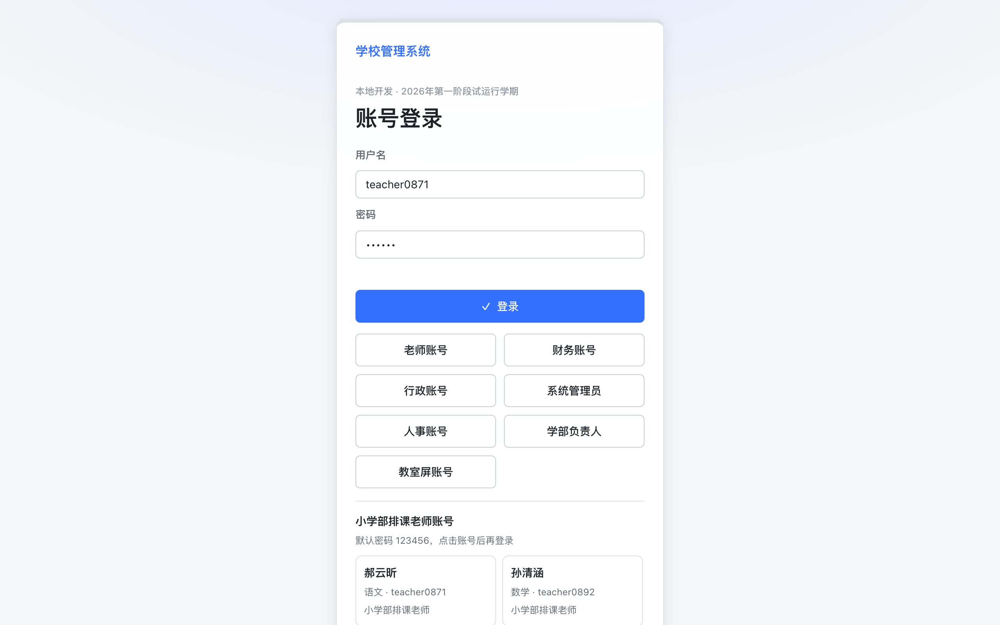

**图 5-2 教师工作台（桌面端）**——通知栏、课时/异常统计卡、下一节课签入、本月薪资概览

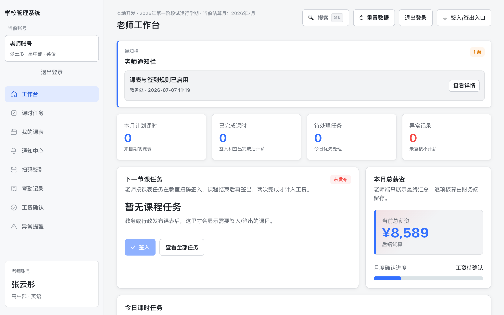

**图 5-3 教师工作台（移动端 375px）**——同一系统响应式适配，教师日常仅用手机即可完成全部操作

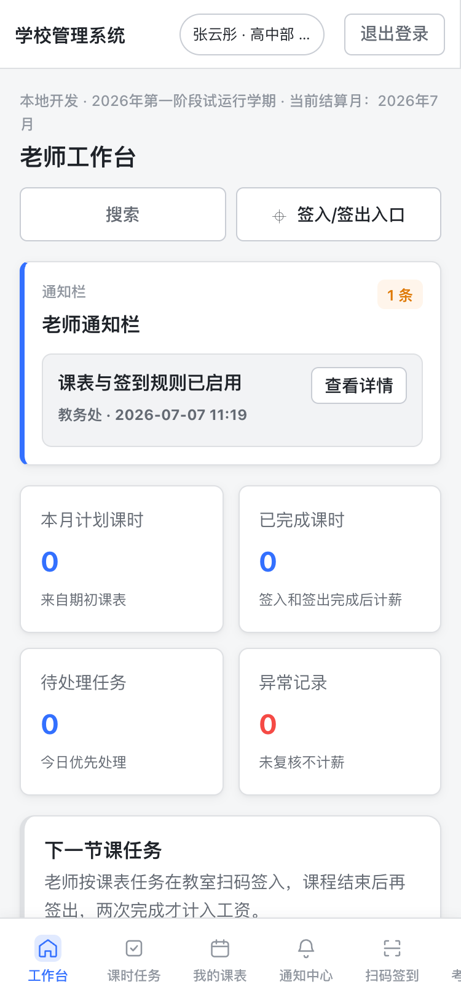

**图 5-4 教师课表**——周视图时间轴，滚动时日期表头吸顶

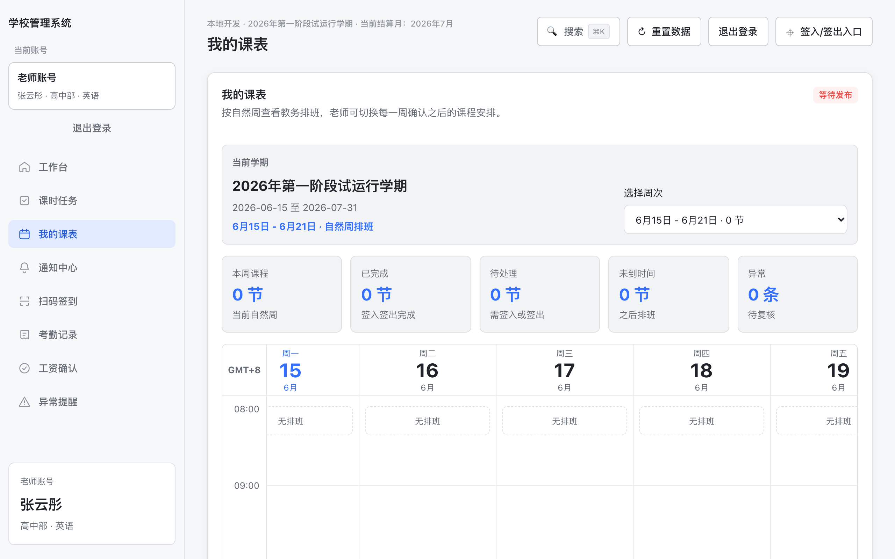

**图 5-5 行政排课**——课程规则、任课配置、预检与异步求解任务、发布与调课的分节长页

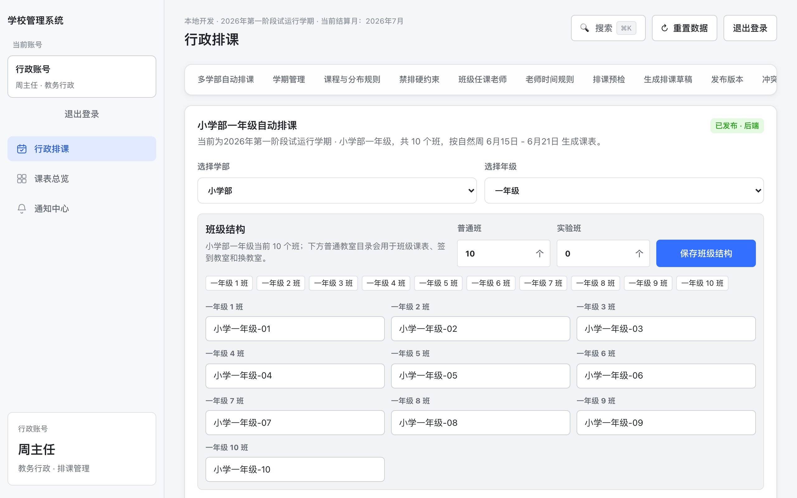

**图 5-6 教室动态码大屏**——教室电脑全屏展示、短周期自动轮换，配合教师手机摄像头扫码签到

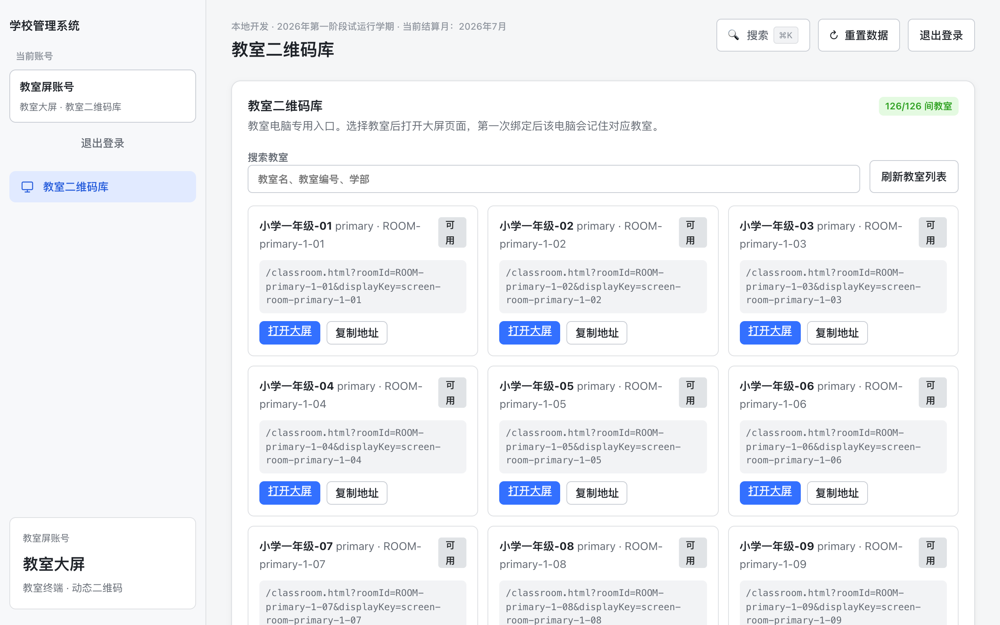

**图 5-7 财务结算看板**——全员结算状态汇总、批量生成/复核/锁定/导出

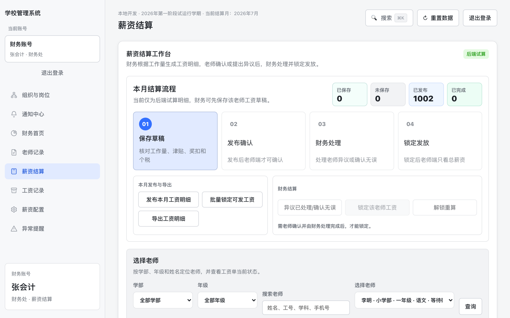

**图 5-8 人员档案**——状态统计、列表/详情双栏、证件与银行卡加密掩码、修改必填原因

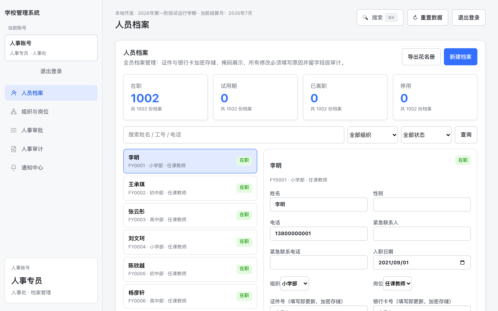

**图 5-9 人事审批**——入职/调岗/离职流程列表与待办

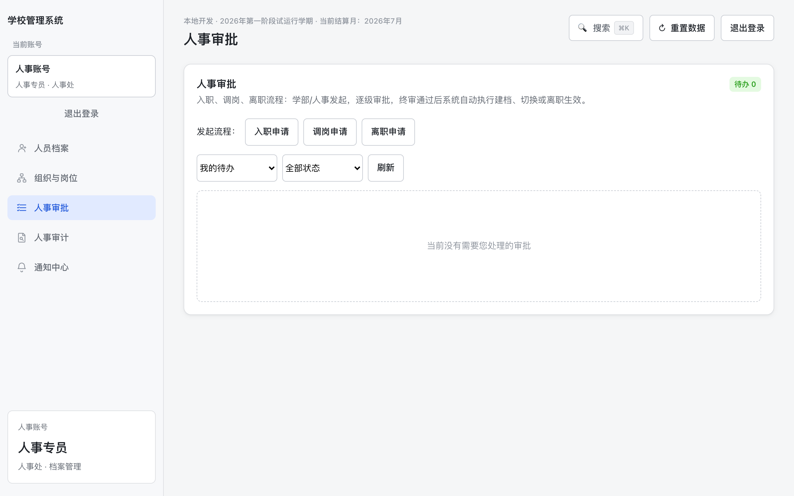

**图 5-10 人事审计**——字段级变更留痕查询（前值/后值/操作人/原因）

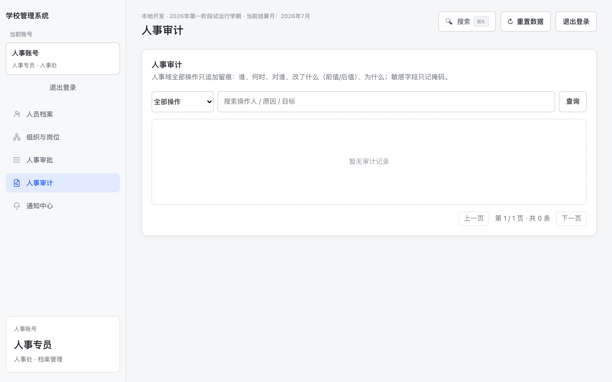

**图 5-11 ⌘K 全局搜索**——功能页与人员聚合搜索，键盘直达

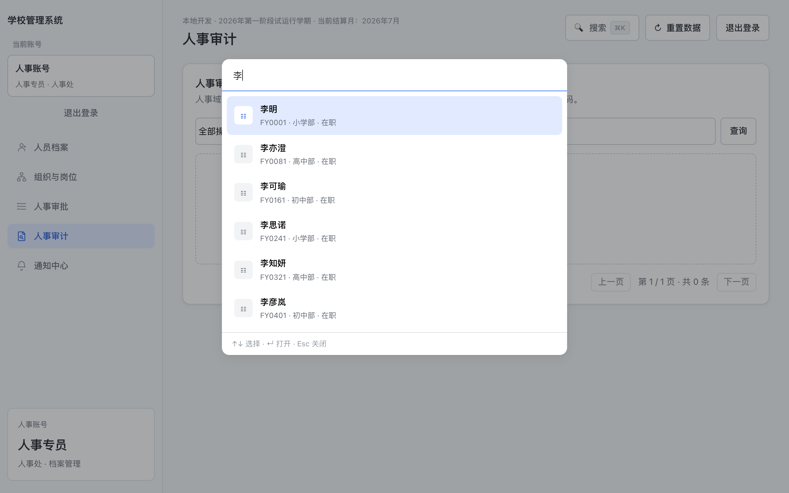

### 5.3 三阶段页面原型说明（同一设计体系）

| 页面 | 原型要点 |
| --- | --- |
| 移动打卡页（全员） | 全屏大按钮（当前班次/状态色）、打卡结果即时反馈、当日时间线、本月异常列表；复用现有移动端框架 |
| 班次与排班（学部负责人） | 班次卡片 + 周排班网格（司机/安保轮班表）、批量套用 |
| 工时事件录入/确认 | 负责人录入表格 + 员工端确认卡片（同现有"工资确认"交互范式） |
| 岗位方案配置（财务） | 原子规则可视化编辑（规则类型下拉+参数表格）、版本对比、生效日期；沿现有薪资配置页风格 |
| 全员工资单（员工端） | 复用教师工资单结构：明细行+计算依据展开+确认/申诉按钮 |
| OA 申请与审批 | 复用现有人事审批的表单+步进器+待办模式，四类流程共用一套交互 |
| 预扣清单（员工端） | 逐条异常卡片（日期/类型/金额/规则）+ 一键申诉入口 + 申诉期倒计时 |
| 报表看板（总校/财务） | 汇总卡 + 分部门表 + 趋势图（沿现有结算看板体系） |

### 5.4 推荐演示脚本（现场 20 分钟，覆盖排课-签到-薪资-人事全链）

1. sysadmin：CSV 导入 3 名教师（预览校验→提交）——2 分钟
2. admin：自动分配任课→预检→异步排课→发布——4 分钟
3. classroom + teacher 手机：动态码签到 + 错教室/过期码拦截——4 分钟
4. finance：生成工资→teacher 确认→财务锁定→导出——4 分钟
5. head_primary→hr→sysadmin：完整入职审批链，新账号即时登录并强制改密——4 分钟
6. hr：改证件号→审计页看掩码 diff→"查看完整"留痕——2 分钟

---

## 6. 项目实施计划及阶段交付成果

### 6.1 总体时间线

| 阶段 | 窗口 | 里程碑 |
| --- | --- | --- |
| 一：教师闭环 | 合同签订 → 2026-07-15 试运行 | 试运行放行（真机扫码验收+首轮结算） |
| 二：人事管控 | → 2026-09-01 | 二阶段放行（迁移窗口+UAT 签字） |
| 三-3A：全员移动考勤 | 2026-09 | 试点部门 2 周流水完整率 ≥99% |
| 三-3B：岗位工资引擎 | 2026-09 → 10 | 逐岗位平行核算清零 |
| 三-3C：OA 审批 | 2026-10 → 11 | 四类流程走通+考勤联动 |
| 三-3D：扣款联动 | 2026-11 → 12 | 预扣→申诉→入工资全链路 |
| 三-3E：津贴报表 | 2026-12 → 2027-01 | 名师津贴全周期+报盘财务确认 |
| 四：体验打磨（可选包） | 3E 后弹性 4~6 周 | 批次化上线 |

### 6.2 各阶段交付成果清单

**每阶段统一交付**：可运行系统 + 全部源代码 + 自动化测试套件 + 操作手册 + 部署/验收文档 + CHANGELOG。

| 阶段 | 专项交付物 |
| --- | --- |
| 一 | 排课/签到/薪资三模块、OR-Tools 求解链、3000 并发压测报告、验收清单 |
| 二 | 人事域模块、PostgreSQL 迁移工具链（试跑/正式/核对）、PII 加密模块、三份角色操作手册、部署验收总手册 |
| 三-3A | 考勤模块（班次/打卡/异常标记/工时事件）、打卡峰值压测报告、试点灰度报告、全员打卡操作说明 |
| 三-3B | 原子规则引擎、八岗位方案配置、逐岗位平行核算报告（学校签字）、主管审批链 |
| 三-3C | 通用 OA 引擎、四类流程、假期额度台账、审批时长看板、统一待办 |
| 三-3D | 扣款规则表（版本化）、预扣清单与申诉链路、免扣互斥断言测试 |
| 三-3E | 津贴评审/课题奖励/寒暑假资格/报销台账、全员报表与人力成本看板、银行报盘导出 |
| 四（可选） | 体验打磨六批次 + 真实用户回访记录 |

### 6.3 实施方法

- **分批上线、每批独立验收独立回滚**，不做大爆炸发布；三阶段每批先选 1 个部门灰度 2 周；
- 每批收口口径固定：全套件回归 → 三视口走查 → 性能核对 → 缓存版本升级 → CHANGELOG → 真实用户抽验；
- 学校配合节点即第 2 章澄清清单，逐项挂接到批次开工条件；
- 薪资类批次执行**平行核算制**：不清零不切换（见 9.2）。

---

## 7. 拟投入项目团队及核心人员简历

> 团队核心成员均毕业于香港科技大学（HKUST），兼具学术训练与工程落地能力。以下为角色配置与核心人员概况，更完整的个人履历以附件简历为准。

### 7.1 团队配置

| 角色 | 人数 | 职责 | 投入度 |
| --- | --- | --- | --- |
| 项目负责人 | 1 | 需求明确、进度与质量负责、学校侧对接 | 全程 |
| 技术负责人 / 架构师 | 1 | 总体架构、进度与质量负责 | 全程 |
| 后端与算法工程 | 1 | 领域模块、约束求解与规则引擎、数据层与迁移 | 全程 |
| 前端与体验工程 | 1 | 前端体系、移动端打卡与审批、设计语言 | 全程 |
| 测试与运维 | 1 | 测试套件、压测、部署、监控与备份、平行核算工具 | 全程（可与后端兼任） |

### 7.2 核心人员简历框架

**缪文思 —— 项目负责人**
- 香港科技大学博士
- 负责学校侧对接、需求明确与整体进度把控

**Andrew —— 技术负责人**
- 香港科技大学硕士研究生
- 负责系统架构规划、开发进度与质量把控

**Jason —— 后端与算法**
- 香港科技大学博士
- 负责 OR-Tools CP-SAT 排课建模（多学部并行、全局冲突约束）、高并发存储层设计、PII 加密体系、薪资规则引擎

**Rick —— 前端与体验**
- 香港科技大学博士
- 负责 Lark 风格设计系统、零框架单页前端体系、弹层/命令面板/SSE 实时体系、全员移动端打卡与审批界面

**Oliver —— 测试与运维**
- 香港科技大学博士
- 负责自动化测试体系、3000 虚拟用户压测框架、readiness 部署自检体系、备份恢复演练、平行核算比对工具

---

## 8. 类似项目案例及可核验材料

### 8.1 最强案例：本项目配套的可运行演示系统

区别于常见投标"案例仅供参考、无法验证"，**本方案配套一套针对贵校业务构建的可运行演示系统，评审现场可任意核验**——评审方直接检验的是"这个团队为这个系统做出的实际结果"，而非相似项目的间接推断：

| 可核验材料 | 核验方式 |
| --- | --- |
| 完整源代码与提交历史 | Git 仓库全程可回溯，评审时可开放查阅 |
| 可运行演示系统 | 现场部署演示，第 5.4 节 20 分钟脚本走全业务链 |
| 自动化测试套件 | 现场执行 `npm run check` + 全部 `test:*`，当场看结果 |
| 3000 并发压测 | 现场执行 `scripts/load-test.js`，当场复现 ~400 req/s / P95≤35ms |
| 工程文档体系 | 阶段 PRD 与开发计划、部署验收总手册、角色操作手册、变更记录 |
| 数据迁移工具链 | `npm run migrate:postgres` 试跑核对当场演示 |

### 8.2 其他项目案例

**[团队其他可披露项目案例待补充：建议每案例包含——项目名称、客户/场景、规模、担任角色、可核验方式（线上地址/客户联系人/开源仓库）]**

---

## 9. 测试、试运行及验收方案初稿

> 完整版见配套附件《部署与验收总手册》（含逐条命令与签字表），本节为方案摘要。

### 9.1 测试体系（随批次同步建设，演示系统已验证方法可行）

| 层级 | 内容 | 执行 |
| --- | --- | --- |
| 静态检查 | 全部源文件语法/规范（`npm run check`） | 每次提交 |
| 单元/集成 | 一二阶段 9 组套件（生产检查、跨年级冲突、学期生命周期、排课任务、数据导出、PII 加密、存储层、人事、审批流含越权 403 断言）；三阶段每批新增专项套件（att2 幂等与异常标记 / pay2 原子规则边界 / oa 额度与互斥 / ded 阶梯与免扣 / awd-rpt 对账一致） | 每次提交 + 每次上线前后 |
| 性能 | 3000 虚拟用户负载、登录风暴、排课基准；三阶段新增打卡早高峰与全员结算批量压测 | 每阶段上线前 |
| 端到端 | 浏览器真实走查：多角色 × 三视口（375/1000/1280）；打卡与审批真机验证 | 每批次 |

### 9.2 试运行方案

- **一阶段**：真实教师名单导入 → 行政真排一轮课 → 真机（学校手机+HTTPS 域名）扫码验收含异常场景 → 财务对照手工表跑一轮结算 → 全部管理账号改默认密码；
- **二阶段**：按三份角色手册执行，入职/调岗/离职各真实走 1 例（含越权拒绝、敏感留痕、计薪拦截验证）；
- **三阶段（每批固定动作）**：1 个试点部门灰度 2 周 → 验收指标达标 → 全校放量；
  - 3A：试点部门连续 2 周打卡流水完整率 ≥ 99%，异常标记与人工核对一致，补卡走流程；
  - 3B：**平行核算制**——每个岗位方案与财务手工表并跑一个月，全员差异金额为 0 或逐条确认归因，学校签字后该岗位才切换真实发薪；
  - 3C：四类流程走通且与考勤联动（批假抵扣异常）；审批平均时长看板可见；
  - 3D：预扣清单→申诉→入工资全链路演练；"已批假不重复扣款"断言测试通过；
  - 3E：名师津贴完整学期周期演练；全员工资总表、分部门表、银行报盘格式经财务书面确认。

### 9.3 验收口径

- 自动验收：readiness 全部检查项通过（求解器/存储/加密密钥/超时任务/数据回填/数据库连接，三阶段扩展批次检查项）；
- 人工验收：一阶段 6 项清单 + 二阶段 UAT 7 项清单 + 三阶段按批次验收标准（上节）；
- 双方签字：验收签字表逐项含结论/验收人/日期/备注；三阶段每批一张，批批闭环。

---

## 10. 数据迁移及系统接口方案

### 10.1 存量数据迁移（Excel/纸质 → 系统）

| 数据 | 迁移方式 | 阶段 |
| --- | --- | --- |
| 教师名单 | 系统内置 CSV 批量导入：模板下载→填写→上传→逐行预览校验（重复工号/手机号/学部枚举）→确认提交，错误定位到行号 | 一 |
| 组织架构/岗位 | 按学校架构表种子化初始化 + 人事页面核对调整 | 二 |
| 存量员工档案 | 教师档案自动回填（幂等，readiness 检查数量完整性）；非教学岗位员工经 CSV 导入建档；证件/银行卡由人事补录（录入即加密） | 二/三 |
| 班次与排班 | 按 Q14 提供的班次表批量配置 | 三 3A |
| 各岗位工资方案 | 按 Q8 盖章稿由财务在方案配置页录入，开发协助核对 + 平行核算兜底 | 三 3B |
| 假期额度基线 | 按 Q10 批量初始化额度台账 | 三 3C |
| 历史工资数据 | 不迁移进系统计算链（口径不可考），以归档文件形式留存备查 | — |

### 10.2 系统内数据层迁移（JSON → PostgreSQL）

三步不停机演进，每步可回退：

```
① json（一阶段初始形态）
② dual 双写观察期（JSON 与 PostgreSQL 并行写，每日 diff 核对，建议 3 天）
③ postgres（目标形态；JSON 文件保留 ≥30 天作回滚底）
```

配套：`npm run migrate:postgres`（试跑不写库 / `--commit` 正式迁移+逐行核对报告）；回滚预案见部署手册（明确标注回滚丢失窗口，属最后手段）。三阶段新增实体直接落 PostgreSQL，不再经历 JSON 形态。

### 10.3 系统接口方案

| 接口 | 说明 |
| --- | --- |
| REST API | 按域命名空间：一阶段 `/api/scheduling|attendance|payroll/*`、二阶段 `/api/hr/*`、三阶段 `/api/att2|oa|pay2/*`；全部接口鉴权+角色白名单+分页+scope 过滤；三阶段新命名空间不触碰一阶段既有接口语义 |
| 打卡接口 | 幂等设计（客户端重试不产生重复流水），沿一阶段签到幂等模式 |
| 实时推送 | SSE `/api/events`：审批、通知、任务完成事件即时推送；多实例部署经 Redis pub/sub 扩展 |
| 文件接口 | CSV 导入（教师/员工名单）、CSV 导出（花名册/工资表/分部门表/银行报盘），UTF-8 BOM 兼容 Excel，CSV 注入防护 |
| 健康/自检 | `/api/health`（监控轮询）、`/api/phase1/readiness`（部署自检，随阶段扩展检查组） |
| 移动端网页 | 全功能响应式移动端（打卡、审批待办、工资条、课表、报销发起），与 PC 端同一系统同一数据，无需安装与商店审核 |
| 对外预留 | 银行代发仅出报盘文件不直连；其他系统对接按需评审后以只读 API 开放 |

---

## 11. 信息安全和个人信息保护方案

### 11.1 数据分级与加密

| 级别 | 数据 | 措施 |
| --- | --- | --- |
| 敏感个人信息 | 身份证号、银行卡号 | **AES-256-GCM 加密落库**，页面仅显示掩码；查看完整值需填写原因，每次查看记入审计（含操作人/时间/IP）；密钥环境变量注入不落代码库，离线备份两份（Q5） |
| 敏感个人信息 | 打卡定位坐标（若 Q7 选定位方案） | 仅采集打卡瞬时坐标；端上明示告知+首次使用记录知情同意；保留 ≤12 个月自动清理 |
| 一般个人信息 | 姓名、电话、紧急联系人 | 访问控制 + 变更走审批/留痕 |
| 薪资数据 | 工资金额、方案、扣款、津贴 | 仅财务与总校可见；人事、主管、学部负责人在任何界面/接口不可见金额（服务端裁剪，自动化越权测试保障）；主管审批加班/请假流程看不到工资 |
| 口令 | 登录密码 | pbkdf2 加盐哈希；默认密码首登强制修改；重置留痕 |

### 11.2 访问控制

- 角色权限矩阵（配套附件《角色与权限说明》）：一角色一条主职责线，职责分离红线（管档案者不见薪资、审批链不可自审自批）；三阶段新增"主管"为组织架构解析的审批语义而非新角色，评审组为学期制临时会签组；
- 学部/部门 scope 过滤：跨范围访问服务端 403（自动化测试断言）；
- 会话管理：令牌哈希存储、过期回收、账号停用即时踢出。

### 11.3 攻击面控制

- 登录保护：按用户名失败锁定 + 单 IP 高上限限速（NAT 友好）、异步口令校验抗风暴；
- 输入防护：请求体上限、CSV 注入转义、全站输出 HTML 转义；打卡/签到接口幂等防重放；
- 传输安全：生产强制 HTTPS；
- 供应链：零 Web 框架、零前端构建依赖，第三方依赖个位数。

### 11.4 审计与可追溯

- 人事全字段级审计（前值/后值/操作人/原因/IP，敏感字段只存掩码 diff），只增不删；
- 打卡流水只增不改，纠错走补卡审批；工资锁定快照永久保留；扣款逐条挂规则版本；
- 制度争议可导出完整证据链：申请 → 审批 → 原始记录 → 规则版本。

### 11.5 个人信息保护合规要点

- 最小必要：只采集业务必需字段；定位方案的告知-同意-留存-清理全链落地（11.1）；
- 员工权利：本人档案可查、联系方式自助变更申请、工资单与预扣清单本人可见可申诉；
- 数据出境：系统与数据全部部署于境内学校自有/租用服务器，无出境场景；
- 留存与销毁：备份保留 90 天；离职人员档案按学校制度留存，销毁需授权并留痕。

---

## 12. 第三方产品、服务及持续费用清单

> 本系统技术栈全开源，**无任何商业软件许可费**。持续费用仅为基础设施类，首年合计 **22,500 元**（已含在报价总额内）；次年起仅产生服务器/域名/接口等基础续费。

| # | 项目 | 用途 | 计费周期 | 首年费用（元） |
| --- | --- | --- | --- | --- |
| 1 | 云服务器与带宽（含数据库、存储、备份空间） | 系统运行（单实例支撑 3000 在线）、算薪与报表生成稳定性保障 | 年 | 16,000 |
| 2 | 短信包与第三方接口预充值 | 短信通知、考勤数据调用、定位等接口首年预充值 | 年（按量续充） | 4,000 |
| 3 | 域名与 SSL 证书 | 生产访问入口与 HTTPS（摄像头扫码必需） | 年 | 1,000 |
| 4 | 开发与协作工具 | 项目管理、代码仓库、设计协作工具授权 | 年 | 1,500 |
| 5 | PostgreSQL / OR-Tools / Node.js / Nginx / Redis | 数据库、求解器、运行时（全开源） | — | 0 |
| | **首年小计** | | | **22,500** |

---

## 13. 详细报价及工作量测算

**报价总额：人民币 875,000 元（含税）**。交付形态：PC 端管理后台 + 移动端网页（同一系统响应式，无需安装 App）。

### 13.1 报价总览

| 费用类别 | 小计（元） | 占比 |
| --- | --- | --- |
| 产品设计费 | 50,000 | 5.7% |
| 核心功能开发费 | 685,000 | 78.3% |
| 测试与部署费 | 35,000 | 4.0% |
| 云资源与工具费（首年） | 22,500 | 2.5% |
| 风险与利润 | 7,500 | 0.9% |
| 税收 | 75,000 | 8.6% |
| **合计（含税）** | **875,000** | 100.0% |

### 13.2 分项明细

**一、产品设计费（50,000 元）**：业务调研与蓝图设计（薪酬结构、绩效规则、工作量折算标准梳理）、PC 端与移动端全套 UI/UX 视觉设计、覆盖复杂薪酬配置与审批交互的可交互原型。

**二、核心功能开发费（685,000 元）**

| 模块 | 说明 | 金额（元） |
| --- | --- | --- |
| 全自动智能排课系统 | 约束求解排课引擎（基本 240,000）+ 小学/初中/高中三学部定制各 20,000；兼容既有体系，连接各部门、各科教师与管理层，一次性收费 | 300,000 |
| 薪酬核算与工作量统计中心 | 系统核心：自定义薪酬结构（基本/岗位/超课时/绩效/津贴/扣款），与考勤、工作量联动自动生成工资表；差异化折算系数、上限规则与多维统计 | 148,000 |
| 审批流引擎与报销预算管控 | 可视化审批流（人事、调课、费用等多类流程）；报销单关联预算科目，预算实时冻结/释放/超支预警与强控，预算执行分析看板 | 77,000 |
| 人事管理与基础平台 | 组织架构、角色与数据权限隔离、操作日志；教职工入职/转正/调动/离职/合同/档案全生命周期线上化 | 56,000 |
| 数据看板与通知预警 | 人事结构、薪酬总额、课时费支出趋势、预算执行率仪表盘；排课变动/审批待办/工资发放/预算预警的多通道通知 | 47,000 |
| 移动端网页（教师端） | 查课表、查工作量、查工资条并签收确认、发起报销与审批操作；响应式网页无需安装 | 32,000 |
| 排课联动与集成 | 调课/代课/连堂课等异常场景处理与留痕、冲突检测高亮；考勤数据、消息通知等第三方接口集成 | 25,000 |
| **小计** | | **685,000** |

**三、测试与部署费（35,000 元）**：薪酬计算与预算管控逻辑的多场景合规测试、历史人事与薪酬数据整理迁移、生产环境部署（含 SSL 与联调）、教务/人事/财务分角色培训与操作手册视频。

**四、云资源与工具费（首年 22,500 元）**：见第 12 章明细。

**五、风险与利润（7,500 元）**：需求变更与薪酬财务政策微调预留、项目管理与协调。

**六、税收（75,000 元）**：系统实施涉及的增值税及相关税费。

### 13.3 付款节点建议

合同签订 → 一阶段试运行验收 → 二阶段 UAT 验收 → 三阶段每批验收（3A~3E）→ 终验；各节点比例双方合同约定。

### 13.4 报价边界

- 本报价**不包含**微信支付收款/退款/分账/对账等支付通道能力；
- 本报价包含：全自动智能排课系统、人员薪资明细及工作量管理系统、学校人员管理系统，三者兼容于同一定制系统内交付；
- 维护期为交付后 **1 年**（见第 15 章）。

---

## 14. 源代码、知识产权及项目退出方案

### 14.1 源代码交付

- 交付**全部源代码**（后端/前端/求解器/测试/脚本/文档），以 Git 仓库形式移交，含完整提交历史；
- 无任何加密、混淆、授权锁、远程许可校验；学校可在自有环境独立构建运行（`npm install` + 文档步骤即可）；
- 每阶段/批次验收即同步移交对应代码，不存在"尾款前扣代码"。

### 14.2 知识产权安排

- 本项目为学校定制开发，**交付物知识产权归属按合同约定**（建议两案任选：定制代码著作权归学校；或归双方共有并授予学校永久免费使用/修改/委托第三方维护的权利）；
- 所依赖第三方组件均为宽松开源许可（MIT/Apache-2.0 等），清单随代码交付，无传染性许可核心依赖，学校商用无风险；
- 开发方保留通用技术方法（非学校业务数据/业务规则）的复用权。

### 14.3 项目退出方案（无论何种原因终止合作，学校不被绑架）

退出交接清单（承诺在退出决定后 30 日内完成）：

1. **代码**：最终版仓库 + 全部分支/标签/提交历史移交；
2. **数据**：PostgreSQL 全量导出（标准 pg_dump，任何团队可接手）+ 全部 CSV 导出口径说明；
3. **密钥与凭证**：加密密钥、服务器凭证、域名/证书控制权全部移交并轮换；
4. **文档**：部署手册、运维 Runbook、三阶段 PRD/四份 TODO、数据字典（表结构 SQL 即文档）；
5. **数据销毁**：开发方本地副本按学校要求销毁并出具书面确认。

技术层面的退出友好性是架构决定的：全开源栈 + 极小依赖面 + 标准 PostgreSQL + 完整文档，任何具备 Node/SQL 能力的团队可接手维护。

---

## 15. 质保和长期运维服务方案

### 15.1 质保期

- 终验通过之日起 **1 年**质保/维护期：质保范围内缺陷（与验收基线不符）免费修复，日常运维（15.3）同期包含；
- 质保不覆盖：学校自行修改代码引发的问题、超出验收范围的新需求（走变更流程）、基础设施故障。

### 15.2 故障响应分级（SLA）

| 级别 | 定义 | 响应 | 恢复目标 |
| --- | --- | --- | --- |
| P0 | 系统不可用 / 数据丢失风险 / 工资错算 | 30 分钟 | 4 小时（含回滚手段） |
| P1 | 核心流程受阻（无法排课/打卡/审批/结算），有临时绕行 | 2 小时 | 1 个工作日 |
| P2 | 非核心功能异常 | 1 个工作日 | 下一维护窗口 |
| P3 | 体验问题 / 咨询 | 2 个工作日 | 排期处理 |

**敏感时段加强**：每月结算周（工资生成→锁定）、开学排课周、早高峰打卡时段（三阶段起）为加强保障期，P0/P1 响应时间减半。

### 15.3 日常运维内容（维护期内包含；维护期满后的长期服务包费用另行商定）

| 项 | 频率 | 内容 |
| --- | --- | --- |
| 健康监控 | 分钟级自动 | `/api/health` 告警（状态/存储/求解器/数据库连接） |
| readiness 巡检 | 每日 | 部署自检全项核对，FAIL 当日处理 |
| 备份与演练 | 每日备份 / 每月演练 | PostgreSQL 全量+WAL，恢复演练留记录 |
| 安全维护 | 每季度 | 依赖安全更新、密钥备份核对、账号权限复审、坐标数据清理核查 |
| 版本更新 | 按需 | 走《系统更新流程》：变更→回归→灰度→记录 |
| 制度规则维护 | 按学校通知 | 工资方案/扣款规则/假期额度调整（版本化生效，不改已结算月份） |
| 培训 | 每学期 1 次 + 新角色按需 | 面向新入职管理人员的角色操作培训 |

### 15.4 运维交接与升级承诺

- 运维期内所有变更进 CHANGELOG（内容/验证/回滚方式），学校可完整审计；
- 每年提供一次系统健康年报（性能趋势、容量评估、风险清单、升级建议）；
- 长期演进（多校区、多实例、新岗位制度）按第 4 章架构预留路径评估，不推倒重来。

---

*本方案书与配套工程文档同源维护；如与合同正文冲突，以合同为准。*
